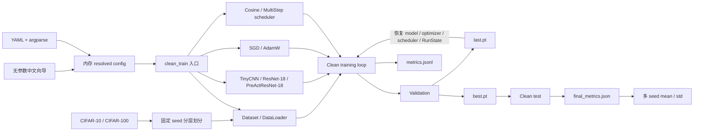

# 干净标签训练架构

训练阶段只访问 `input`、干净 `target` 和稳定 `index`。每轮结束在 validation 上选择最佳 checkpoint；完整训练结束后重新加载 `best.pt` 再计算 test，避免使用测试集选择模型。

正式实验使用 `configs/experiment/cifar10_clean_baseline.yaml`，默认 PreActResNet-18、SGD、cosine scheduler 和 200 epochs。`cifar10_clean_smoke.yaml` 使用 TinyCNN 和小数据子集，仅用于全链路调试。
