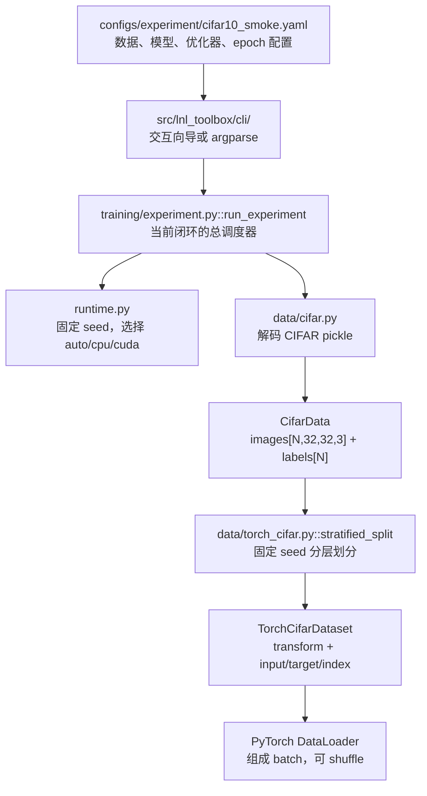
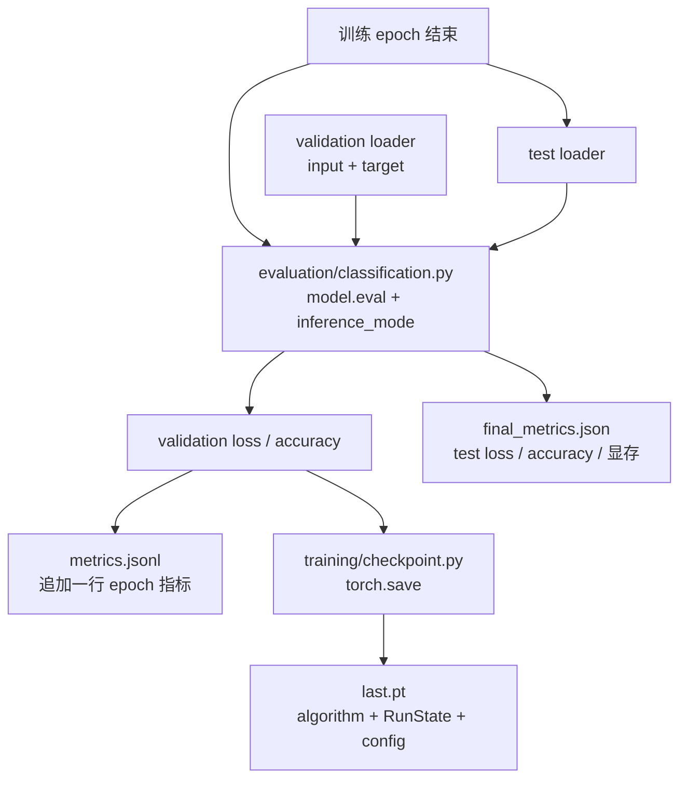
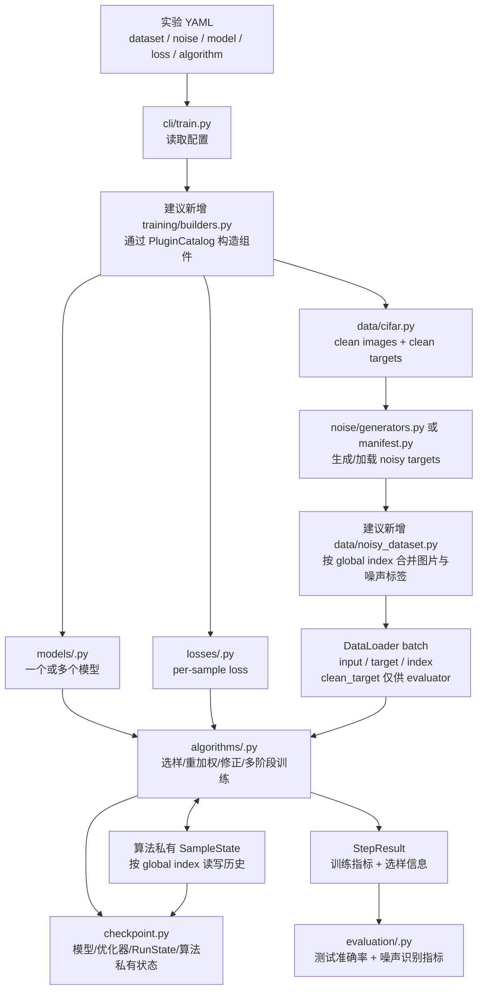
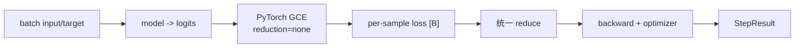
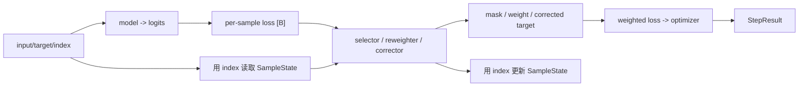
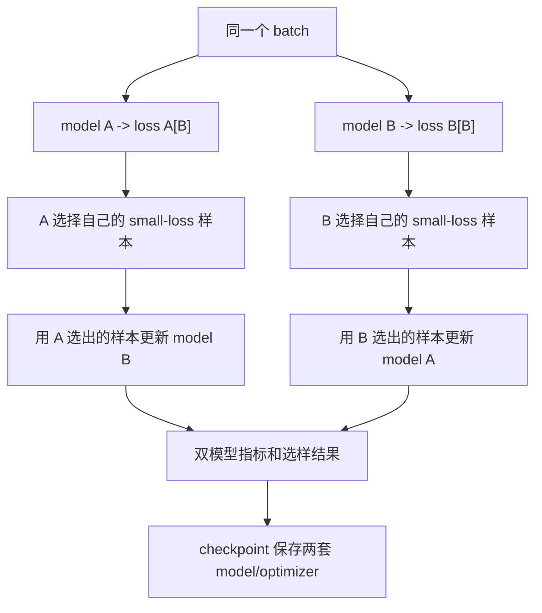

# LNL Toolbox 数据流开发指南

本文面向第一次接触本项目的开发者，回答两个问题：

1. 当前已经跑通的 CIFAR + TinyCNN + CE 小闭环，数据到底经过了哪些文件？
2. 将来加入一个标签噪声学习（LNL）算法时，理想的数据应该怎样流动？

本文只描述当前仓库中的真实代码，并把尚未存在的理想组件明确标为“建议新增”。

---

## 1. 先认识三种“数据”

入门时最容易混淆的是：项目里不只有图片和标签。

| 数据种类 | 例子 | 用途 |
|---|---|---|
| 样本数据 | 图片、标签、全局 `index` | 输入模型并计算 loss |
| 运行状态 | epoch、global step、模型参数、优化器状态 | 控制训练和恢复训练 |
| 实验产物 | 配置、指标、checkpoint、环境信息 | 复现实验和比较算法 |

当前 Dataset 返回的单个样本是：

```python
{
    "input": image_tensor,  # [3, 32, 32]，已经增强和归一化
    "target": label,        # 当前是干净标签
    "index": global_index,  # 样本在原始数据集中的稳定编号
}
```

`index` 对普通 CE 训练暂时没有被使用，但它是以后维护逐样本 loss、噪声标签、选样结果和历史状态的关键。DataLoader 即使 shuffle，`index` 也不会改变。

---

## 2. 当前小闭环：启动阶段的数据流

当前真正执行训练的是 `src/lnl_toolbox/training/experiment.py`，不是通用的 `engine/runner.py`。



### 2.1 配置如何进入程序

1. `configs/experiment/cifar10_smoke.yaml` 或 `cifar10_clean.yaml` 保存实验参数。
2. `src/lnl_toolbox/cli/` 在无参数时通过 `PromptSession` 选择模板并覆盖内存配置；有参数时继续由 argparse + PyYAML 得到 Python `dict`。
3. `train.py` 将这个字典、`--output-dir` 和 `--resume` 交给 `training/experiment.py::run_experiment()`。

注意：当前 `experiment.py` 仍直接构造 `TinyCNN` 和 `SupervisedClassificationAlgorithm`；loss 已改为把顶层 `loss` mapping 交给 `PluginCatalog` 构造。

### 2.2 原始 CIFAR 如何变成 Dataset

1. `training/experiment.py` 根据 `data.name` 选择 `load_cifar10()` 或 `load_cifar100()`。
2. `src/lnl_toolbox/data/cifar.py` 读取仓库根目录 `data/cifar10/` 或 `data/cifar100/` 中的 pickle 文件。
3. `cifar.py` 把图片转成 NumPy `uint8` 数组 `[N, 32, 32, 3]`，把标签转成 `[N]`，封装成 `CifarData`。
4. `src/lnl_toolbox/data/torch_cifar.py::stratified_split()` 依据标签和 seed 生成 train/validation 的全局索引。
5. 同一文件中的 `TorchCifarDataset` 保存 `CifarData` 和索引，并在 `__getitem__()` 中：
   - 用 PIL 包装图片；
   - 对训练集做 random crop、horizontal flip 和 normalize；
   - 对验证/测试集只做 normalize；
   - 返回 `input`、`target`、`index`。
6. `training/experiment.py::_loader()` 把 Dataset 包装成 PyTorch `DataLoader`。

这里的职责边界是：

- `data/cifar.py` 只负责“读懂磁盘文件”；
- `data/torch_cifar.py` 负责“变成 PyTorch 能训练的样本”；
- `training/experiment.py` 决定“使用哪个数据集、如何划分以及如何组 batch”。

---

## 3. 当前小闭环：一个训练 batch 的数据流

```mermaid
flowchart LR
    A["DataLoader batch<br/>input, target, index"]
    B["core/batch.py::Batch<br/>通用 payload 信封"]
    C["algorithms/supervised.py::step"]
    D["input/target 搬到 GPU"]
    E["models/tiny_cnn.py<br/>input -> logits"]
    F["losses/torch_losses.py<br/>logits + target -> configured loss [B]"]
    G["zero_grad -> backward -> optimizer.step"]
    H["core/result.py::StepResult<br/>loss, accuracy, samples"]
    I["training/experiment.py<br/>按样本数汇总 epoch 指标"]

    A --> B --> C --> D --> E --> F --> G --> H --> I
```



具体发生的事情如下：

1. DataLoader 产生一个字典。经过默认 collate 后：
   - `input` 是 `[B, 3, 32, 32]` Tensor；
   - `target` 是 `[B]` Tensor；
   - `index` 是 `[B]` Tensor。
2. `training/experiment.py` 用 `core/batch.py::Batch(raw_batch)` 包一层。
   - `Batch` 是一个通用信封；
   - core 不需要知道里面是图片、文本还是图数据。
3. `algorithms/supervised.py::SupervisedClassificationAlgorithm.step()` 从 `batch.payload` 取出 `input` 和 `target`。
4. `input` 和 `target` 被移动到 `runtime.py` 选择的设备。
5. `models/tiny_cnn.py::TinyCNN` 把图片变成 `[B, classes]` 的 logits。
6. 配置选中的 PyTorch loss 用 logits 和 target 计算 `[B]` 逐样本 loss。
7. 算法校验 shape、求均值，再执行清梯度、反向传播和参数更新。
8. 算法返回 `core/result.py::StepResult`，其中包含 batch loss、batch accuracy 和样本数。
9. `training/experiment.py` 对所有 batch 做加权汇总，得到一个 epoch 的训练指标。

当前 `index` 会跟随 batch 到达算法，但 `SupervisedClassificationAlgorithm` 没有读取它。这正是以后 LNL 算法要扩展的位置。

---

## 4. 当前小闭环：验证、测试和产物流向



### 4.1 验证和测试

`src/lnl_toolbox/evaluation/classification.py::evaluate_classification()` 直接读取 DataLoader 的字典，不经过 `core.Batch`：

- 切换到 `model.eval()`；
- 禁止梯度；
- 计算全数据集平均 loss 和 accuracy。

每个 epoch 后运行 validation，全部训练结束后运行 test。

### 4.2 输出文件

`training/experiment.py` 在 `artifacts/runs/<运行目录>/` 生成：

| 文件 | 数据从哪里来 | 含义 |
|---|---|---|
| `resolved_config.yaml` | CLI 读取并覆盖后的配置字典 | 这次实验实际用了什么参数 |
| `environment.json` | `runtime.py` 和 PyTorch 环境 | Python、PyTorch、CUDA、GPU、seed |
| `metrics.jsonl` | 算法的 `StepResult` 汇总 + evaluator | 每个 epoch 和最终测试指标 |
| `last.pt` | `training/checkpoint.py` | 模型、优化器、`RunState`、已完成 epoch、配置 |
| `final_metrics.json` | test evaluator | 最终 test loss、accuracy、显存峰值 |

### 4.3 恢复训练

恢复方向与保存方向相反：

```text
last.pt
  -> training/checkpoint.py::load_checkpoint()
  -> algorithms/supervised.py::load_state_dict()
  -> 恢复 TinyCNN 参数和 optimizer 状态
  -> 恢复 core/state.py::RunState
  -> training/experiment.py 从下一个 epoch 继续
```

---

## 5. 通用 core 在当前闭环中的位置

`src/lnl_toolbox/core/` 不是训练实现，而是组件之间约定的“插头形状”。

| 文件 | 当前意义 |
|---|---|
| `core/batch.py` | 用通用 `Batch.payload` 携带算法输入 |
| `core/algorithm.py` | 规定算法应该实现 setup、cycle、step、保存和恢复等方法 |
| `core/context.py` | 把工作目录、配置、seed 和服务交给算法 |
| `core/state.py` | 保存框架级 cycle、step、phase 和指标 |
| `core/result.py` | 统一算法 step 的输出形式 |
| `core/storage.py` | 定义更通用的产物和 checkpoint 协议，目前小闭环尚未完整使用 |

`src/lnl_toolbox/engine/runner.py` 实现了任务无关的生命周期 Runner，但当前 CIFAR 小闭环没有调用它，而是在 `training/experiment.py` 中手写训练循环。

开发时需要特别注意：当前 `SupervisedClassificationAlgorithm.step()` 自己增加 `state.step`，`engine/runner.py` 也会增加 `state.step`。在统一两条运行路径之前，不能直接把现有监督算法塞入通用 Runner，否则 global step 会重复增加。

---

## 6. 当前已有的 LNL 零件为什么还没有进入小闭环

仓库已经有以下文件，但它们目前是独立示例：

| 文件 | 已有能力 | 当前缺口 |
|---|---|---|
| `noise/generators.py` | symmetric、pairflip、简化 IDN | `training/experiment.py` 没有调用 |
| `noise/manifest.py` | 保存 clean/noisy targets、flip mask 和转移信息 | `TorchCifarDataset` 不读取 manifest |
| `cli/make_noise.py` | 从 `.npy` 标签单独生成 manifest | 与 `lnl-train` 是两条命令链 |
| `losses/numpy_losses.py` | NumPy CE/GCE 数学示例 | 不能直接参与 PyTorch 反向传播 |
| `algorithms/coteaching.py` | NumPy small-loss 交叉选样 | 还没有双网络训练 Algorithm |
| `evaluation/metrics.py` | selection precision/recall | 当前训练 evaluator 没有调用 |
| `plugins/catalog.py` | 按 kind/name 注册和构造插件 | 当前仅 loss 进入生产训练构造链 |
| `plugins/builtin/catalog.py` | 注册 NumPy 参考与 PyTorch loss | 模型和算法仍未统一走 catalog |

因此，当前闭环准确地说是“可恢复的干净标签监督分类闭环”，而不是完整的 LNL 闭环。

---

## 7. 加入一个算法后的理想总体数据流

下面的图表示理想目标。其中带“建议新增”的文件目前并不存在，是下一阶段可以创建的结构。



这个理想数据流有两个核心原则：

1. **训练算法看到 noisy target，evaluator 才能看到 clean target。** 防止算法偷看答案。
2. **所有逐样本状态都通过稳定 global index 读写。** 不能使用 batch 内位置代替样本身份。

---

## 8. 理想的 batch 数据合同

建议未来噪声 Dataset 返回：

```python
{
    "input": image_tensor,
    "target": noisy_target,       # 算法实际训练的标签
    "index": global_index,        # 读写逐样本状态的键

    # 以下是真值字段，只允许 evaluator 使用
    "clean_target": clean_target,
    "is_clean": noisy_target == clean_target,
}
```

更严格的实现可以把真值字段放到单独的 evaluator 数据视图或 metadata 中，避免训练算法误访问。

噪声标签的合并过程应当是：

```text
data/cifar.py 的 clean_targets
  -> noise/generators.py 生成 NoiseManifest
     或 noise/manifest.py 加载已有 NoiseManifest
  -> 根据 manifest.dataset_fingerprint 检查数据是否匹配
  -> 根据 global index 查询 noisy_targets[index]
  -> Dataset 的 target 返回 noisy target
```

validation/test 默认仍使用干净标签，除非某篇论文的正式实验协议明确要求其他设置。

---

## 9. 一个新算法内部的理想 batch 流程

### 9.1 简单算法：只替换 loss，例如 GCE



这类算法复用 `SupervisedClassificationAlgorithm`。当前生产路径已经统一为：

1. 实验 YAML 的顶层 `loss` mapping 交给 `plugins/builtin/catalog.py`；
2. `PluginCatalog` 按 `kind="loss"` 构造 PyTorch loss；
3. loss 只负责输出严格的 `[B]` 逐样本张量；
4. `SupervisedClassificationAlgorithm` 校验合同并执行 `mean`，evaluator 则按样本求和后除以样本总数。

当前可训练组件为 CE、GCE、NCE、MAE、RCE 和 APL。标准 GCE 直接计算论文的 `(1-p_y^q)/q`，不做隐式概率截断。APL 要求 `alpha`、`beta` 严格为正，P0 active 仅为 NCE、passive 仅为 MAE 或 RCE；这些约束在 loss 类、catalog 直接构造和 YAML builder 三条路径上一致。NumPy CE/GCE 仅作为 `kind="numpy_loss"` 的公式参考，不进入反向传播路径。

### 9.2 选样或重加权算法



算法私有状态不要塞进通用 `RunState`。例如可以由具体算法自己保存：

```python
sample_state.loss_ema[index]
sample_state.selected_mask[index]
sample_state.clean_probability[index]
sample_state.corrected_target[index]
```

算法的 `state_dict()` 必须包含这些数据，`training/checkpoint.py` 才能让恢复训练前后一致。

### 9.3 多网络算法，例如 Co-teaching



这类算法不应该被压缩成一个 loss 函数。建议新增完整的 `algorithms/coteaching_torch.py`，由它拥有两个模型、两个优化器、forget/remember rate 日程和私有状态。

---

## 10. 推荐的文件落点

以下是加入新算法时比较清楚的目录分工。带“建议新增”的路径尚未实现。

```text
configs/
  experiment/<实验名>.yaml          # 一次完整实验的组合配置

src/lnl_toolbox/
  data/
    cifar.py                        # 已有：读取原始 CIFAR
    torch_cifar.py                  # 已有：PyTorch Dataset 与 transform
    noisy_dataset.py                # 建议新增：合并 manifest 与 global index

  models/
    tiny_cnn.py                     # 已有：smoke 模型
    preact_resnet.py                # 建议新增：正式 CIFAR baseline

  losses/
    torch_losses.py                 # 已有：CE/GCE/NCE/MAE/RCE/APL

  algorithms/
    supervised.py                   # 已有：单模型监督训练
    <algorithm>.py                  # 新算法的完整生命周期与私有状态

  noise/
    generators.py                   # 已有：噪声生成
    manifest.py                     # 已有：噪声记录和复现

  evaluation/
    classification.py              # 已有：loss/accuracy
    noise_detection.py              # 建议新增：selection precision/recall 等

  plugins/
    catalog.py                      # 已有：注册和构造机制
    builtin/catalog.py              # 已有：注册并构造可训练的 PyTorch loss

  training/
    builders.py                     # 建议新增：根据 YAML 和 registry 组装组件
    experiment.py                   # 保留：调度数据、训练、评估和产物
    checkpoint.py                   # 已有：保存/恢复全部状态
```

---

## 11. 新增算法的开发步骤

建议按以下顺序实现，避免算法代码和框架代码混在一起。

1. **先写配置**：明确算法需要几个模型、什么 loss、什么噪声和哪些超参数。
2. **定义 batch 需要的字段**：普通算法只需 `input/target/index`；评测噪声识别时还需隔离的真值信息。
3. **实现 PyTorch 数学核心**：优先保证能输出 `[B]` 的逐样本 loss 或 weight/mask。
4. **实现 Algorithm 生命周期**：放在 `algorithms/<algorithm>.py`，复杂方法自己拥有模型、优化器和阶段状态。
5. **实现 `state_dict/load_state_dict`**：保存所有模型、优化器、scheduler 和逐样本历史。
6. **注册插件**：在 `plugins/builtin/catalog.py` 中注册工厂和 capability。
7. **接入构造层**：配置中的算法名字必须真正决定创建哪个对象，不能继续在 `experiment.py` 写死。
8. **增加 evaluator**：既看最终分类准确率，也看算法声称解决的问题，例如选中样本的 precision/recall。
9. **增加 unittest**：分别测试数学核心、一个训练 step、checkpoint roundtrip 和固定 seed 可复现。
10. **最后跑 smoke**：验证配置、DataLoader、GPU、指标、checkpoint 和恢复训练组成完整闭环。

---

## 12. 开发者最需要记住的边界

- 原始数据解码属于 `data/cifar.py`，不要写进算法。
- 数据增强和 PyTorch Dataset 属于 `data/torch_cifar.py`。
- 噪声标签应通过 `NoiseManifest + global index` 注入，不要在每个 batch 临时随机改标签。
- 模型结构属于 `models/`，loss 数学属于 `losses/`，训练决策属于 `algorithms/`。
- `training/experiment.py` 负责组装、循环、评估和输出，不应该理解某个论文算法的内部数学。
- 通用 `core/` 不应该依赖 CIFAR、PyTorch CE、噪声率或双网络假设。
- clean target 只能用于评估，不能泄漏给训练算法。
- 复杂算法的逐样本历史属于算法私有状态，但必须进入 checkpoint。
- 当前 `engine/runner.py` 与实际训练循环尚未统一；修改生命周期前先解决 global step 的唯一归属。

一句话概括当前与理想状态：

```text
当前：YAML -> registry 构造 CE/GCE/NCE/MAE/RCE/APL
     -> per-sample loss [B] -> Algorithm 聚合 -> 评估 -> checkpoint

理想：YAML -> registry 组装数据/噪声/模型/loss/算法
     -> Algorithm 使用 global index 管理逐样本状态
     -> 通用评估与完整 checkpoint
```
