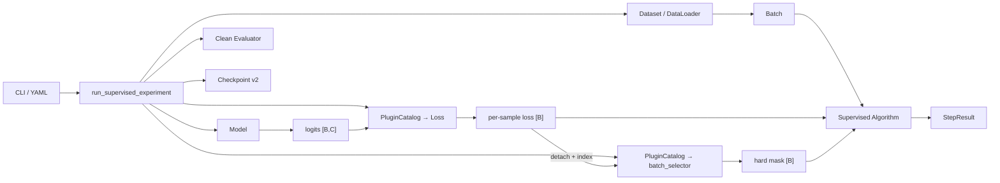

# LNL Toolbox 跨模块接口规范

本文是当前训练路径的唯一人类可读接口规范，供开发者和 Codex 修改代码时查阅。它只记录已经实现的合同和明确标注的预留边界，不解释论文方法。

权威顺序：**代码与自动化测试 > 本文 > 其他架构或研究文档**。若三者不一致，先以代码和测试判断现状，再在同一次修改中更新本文。

## 1. 当前生产边界



当前事实：

- `training/experiment.py::run_supervised_experiment` 是 clean/noisy CIFAR 的唯一生产训练循环。
- `run_experiment` 是兼容别名；`run_clean_experiment` 是 clean-only 包装。
- 生产路径固定使用 `SupervisedClassificationAlgorithm`；尚不能通过 YAML 替换任意 Algorithm。
- `engine/runner.py` 没有进入该路径。两者都会推进 step，不能直接嵌套。
- Loss 和无状态 batch Selector 已通过 `PluginCatalog` 构造；Model、Algorithm、Evaluator 尚未全部插件化。
- 通用 `all`/`small_loss` Selector 已接入单模型监督路径；二分类 asymmetric-RCN importance-weight 组件可通过内部 treatment 合同独立调用，但尚未接入公开训练配置；RiskCorrector 尚未接入。
- Co-teaching 的双网络协调和 peer exchange 仍属于独立 Algorithm/Pipeline，不由通用 Selector 承担。

## 2. 模块职责与依赖方向

| 模块 | 拥有什么 | 不得负责什么 |
|---|---|---|
| `core/` | 任务无关的 `Batch`、`RunState`、`StepResult`、生命周期 Protocol | 依赖 PyTorch、CIFAR 或 LNL 假设 |
| `cli/` | 交互、argparse、YAML mapping | 训练数学、标签修改、optimizer step |
| `data/` | 原始数据解码、transform、Dataset、稳定 index | 选样、Loss、论文训练策略 |
| `noise/` | 噪声生成、Manifest、后验快照、转移矩阵估计与验证 | 选样、模型更新、读取验证指标 |
| `models/` | `inputs -> logits` | 读取标签、Manifest 或逐样本历史 |
| `losses/` | `logits + targets -> loss[B]` | 聚合、选样、optimizer、clean label |
| `selectors/` | detached `scores[B] + index[B] -> hard mask[B]` | 模型、optimizer、backward、peer exchange、生命周期 |
| `algorithms/` | 组合模型、Loss、优化器和训练决策；拥有私有状态 | 数据文件解析、实验目录管理 |
| `evaluation/` | clean validation/test 指标 | 参与训练更新或泄漏 clean label |
| `training/` | 组装、循环、恢复、产物 | 实现论文公式或把算法逻辑写死在公共入口 |
| `plugins/` | 注册、发现、按配置构造组件 | 执行训练生命周期 |

允许的主要依赖方向：

```text
cli → training
training → data / noise / models / losses / algorithms / evaluation / plugins
algorithms → core / models / losses / selectors
evaluation → losses
data ↔ noise 只通过显式 mapping/Manifest 连接
models/training → noise 只通过 PosteriorSnapshot 连接
core → 标准库
```

## 3. 配置与 Runner 合同

统一入口：

```python
run_supervised_experiment(
    config: dict,
    output_dir: str | Path | None = None,
    resume: str | Path | None = None,
) -> Path
```

配置必须是 YAML-compatible mapping。顶层字段：

| 字段 | 要求 |
|---|---|
| `data` | 必须；dataset、root、划分和可选子集大小 |
| `loader` | 必须；batch size、workers、pin memory |
| `model` | 必须；当前支持 TinyCNN、ResNet-18、PreActResNet-18 |
| `optimizer` | 必须；当前支持 SGD、AdamW |
| `trainer` | 必须；epochs、device |
| `loss` | 可选；缺省为 `{name: ce}` |
| `selector` | 可选；缺省为 `{name: all}`，另支持固定 keep-rate `small_loss` |
| `scheduler` | 可选；none、cosine、multistep |
| `noise` | 可选；省略即 clean |
| `seed` / `output_root` | 可选；有稳定默认值 |

噪声配置只能选择一种模式：

```yaml
# 运行开始时生成一次
noise:
  name: symmetric       # 或 pairflip
  rate: 0.4
  seed: 17
  manifest_filename: noise_manifest.npz
```

```yaml
# 导入外部映射
noise:
  manifest: data/noise/example.npz
  manifest_filename: noise_manifest.npz
```

规则：

- `manifest` 不得与 `name/rate/seed` 混用。
- 训练期间不得按 batch 重新采样噪声。
- 最终映射必须写入 run-local manifest。
- `run_dir` 在创建 manifest 前必须解析为绝对路径；相对 `output_root` 以启动命令时的工作目录为基准。
- `run_clean_experiment` 和多 seed suite 必须拒绝非空 `noise`。
- 新配置使用顶层 `loss`；不得再用 `algorithm: {name: ce}` 表示 CE。
- 插件注册不代表已经接入生产 Runner；`selector` 已接入通用训练路径，
  当前配置出现尚未接入的 `transition_estimator` 时必须明确报错，不得静默忽略。
- 实际配置必须写入 `resolved_config.yaml`。

## 4. 样本身份与 global index

### 4.1 完整身份

样本的完整主键是：

```text
(dataset, split, global_index)
```

单独的 `global_index` 只在同一 dataset 和 split 内唯一。train 的 index `7` 与 test 的 index `7` 不是同一个样本。

### 4.2 index 不变量

- `global_index` 是样本在原始 split 中的位置，不是 Dataset 子集位置或 batch 位置。
- shuffle、数据增强、subset、sampler 和 noisy wrapper 都不得改变它。
- 所有跨 epoch 的逐样本状态必须通过 global index 读写。
- 持久化逐样本数组时，必须同时保存对应 `global_indices`；不得依靠当前数组顺序猜测身份。
- 非连续 index 可以使用显式 mapping，或使用覆盖完整原始 split 的数组；两者必须明确区分。
- 禁止用 `enumerate(loader)`、batch offset 或排序后的位置作为样本身份。

global index 的当前用途：

| 使用方 | 用法 |
|---|---|
| `NoiseManifest` | `global_indices[i] -> noisy_targets[i]` |
| `NoisyTargetDataset` | 按样本 index 查找训练 target |
| batch Selector | 用 stable index 对相同 score 做确定性裁决；当前不保存逐样本历史 |
| Checkpoint | 保存逐样本状态及其 index 对齐信息 |
| Evaluator | 仅在需要逐样本对齐时连接预测与评测真值 |

## 5. Dataset 与 Batch 合同

单样本必须返回且只能依赖以下公共字段：

```python
{
    "input": Tensor[C, H, W],
    "target": int,
    "index": int,
}
```

默认 collate 后：

```text
input  : Tensor[B,C,H,W]
target : LongTensor[B]
index  : LongTensor[B]
```

职责：

- `TorchCifarDataset` 读取原始标签，不接受 `targets=` override。
- noisy train 使用 `NoisyTargetDataset(clean_dataset, global_indices, noisy_targets)`。
- wrapper 只能替换 `target`，必须保持 input、transform、长度和 index 不变。
- validation/test 使用独立 clean Dataset。
- `clean_target`、`flip_mask`、`is_clean` 不得进入训练 batch。
- Algorithm 不得通过 Dataset 内部属性绕过上述隔离。

`core.Batch` 只是 payload 信封。当前监督 Algorithm 约定 `Batch.payload` 为上述字典；通用 core 本身不固定这些字段。

## 6. Noise Manifest 合同

Manifest v2 的核心字段：

| 字段 | 合同 |
|---|---|
| `dataset` / `split` | 标识 index 的作用域；训练 manifest 的 split 为 `train` |
| `global_indices` | `int64[N]`，一维、唯一、非负 |
| `clean_targets` | `int64[N]`，只用于生成记录和训练前校验 |
| `noisy_targets` | `int64[N]`，训练实际使用的标签 |
| `num_classes` | 与当前 dataset 一致 |
| `dataset_fingerprint` | 绑定 clean target 对齐关系 |
| `mapping_hash` | 绑定上下文、indices 和 noisy targets |
| `transition_matrix` | 可选 `[C,C]`，有限、非负、每行和为 1 |
| `per_sample_transition` | 可选 `[N,C]`，有限、非负、每行和为 1 |

应用前必须验证：dataset、split、类别数、标签范围、fingerprint、required indices 覆盖和所有概率矩阵。

- 外部 manifest 可以精确覆盖当前训练划分，也可以是其超集。
- Manifest 中缺少任一 required index 时必须失败。
- v1 缺少 indices 时只能解释为连续 `0..N-1`；无法证明对齐时必须失败。
- resume 只读取 run-local manifest，并核对 mapping hash 与文件 SHA-256。
- Loss、Selector 和训练 Algorithm 不得读取 `clean_targets`。

### 6.1 转移矩阵估计合同

离线估计链路固定为：

```text
warm-up model → PosteriorSnapshot → TransitionEstimator → TransitionArtifact
```

`PosteriorSnapshot` 只包含 noisy posterior `float64[N,C]`、noisy target
`int64[N]`、global index `int64[N]` 以及 dataset/split。它不得包含 clean
target、flip mask 或真实转移矩阵。概率必须有限、非负且逐行和为 1；index
必须唯一、非负。`snapshot_hash` 绑定以上全部内容和上下文。

Estimator 的唯一公共调用为：

```python
estimate(snapshot: PosteriorSnapshot) -> TransitionArtifact
```

`TransitionArtifact.matrix` 是行随机 `[C,C]` 矩阵，方向只能是：

```text
T[i,j] = P(noisy=j | clean=i)
p_noisy = p_clean @ T
```

Artifact 必须保存格式版本、estimator 名称、来源 snapshot hash、配置/诊断
metadata 和 artifact hash；加载时验证内容完整性，不得隐式裁剪或归一化。
`KnownTransition` 与 estimator 产物共享相同矩阵方向和 Tensor 输出接口。

`training/snapshots.py::collect_posterior_snapshot()` 是唯一 posterior 收集入口：
在 `inference_mode` 下按 batch 的 `input/target/index` 收集，按 global index 排序，
并恢复模型原训练状态。它不负责 warm-up 训练，也不读取 clean target。

当前离线、无状态 estimator：

- `anchor`：每类选择 noisy posterior 最大的样本；精确并列取最小 global index。
- `dual_t`：复用 Anchor 得到 `T_club`，按 posterior argmax 与 noisy target
  频数估计 `T_spade`，输出 `T_club @ T_spade`。空 intermediate 类别直接失败；
  factors、counts 和 anchors 记录在 Artifact metadata。

两者可由 plugin catalog 构造，但尚未接入统一 runner，也不是 Loss。
Forward/Backward、Importance Weighting 等未来消费者只能接收 Artifact，不能反向
修改 Snapshot。`NoiseManifest.per_sample_transition[N,C]` 只是每个样本真实类别
对应的一行，不等于 PDL 的完整 `T(x)[N,C,C]`。

## 7. Model、Loss 与 Algorithm 合同

### 7.1 Model

```python
logits = model(inputs)  # FloatTensor[B,C]
```

必须返回原始 logits。Model 不得读取 target、index、Manifest 或 clean label。

### 7.2 Loss

```python
per_sample = loss(logits, targets)  # FloatTensor[B]
```

必须满足：

- `logits` 为 `[B,C]`；`targets` 为 `[B]` 的 `torch.long`，值位于 `[0,C)`。
- logits、targets、Loss module 位于同一设备。
- 返回严格 `[B]`，保留 autograd graph。
- Loss 内不得 `mean/sum/detach/item/numpy`。
- `validate_per_sample_loss(values, B)` 在训练和评测边界强制检查 shape。
- 当前只支持硬标签单标签分类；不包含 soft label、mixup、label smoothing 或 multi-label。

### 7.3 当前监督 Algorithm

```python
contribution = selector_adapter.resolve(
    SelectionInput(per_sample.detach(), indices)
)
objective = reduce_per_sample_loss(
    per_sample,
    contribution,
    ReductionSpec("weight_sum_mean"),
)
objective.backward()
optimizer.step()
```

用于 backward 的 `per_sample` 保留 autograd graph；只有评分副本会 detach。Selector adapter 将旧的 hard mask 转成 `ContributionResult(mask, ones)`，统一 reducer 计算 `sum(weight * loss) / sum(weight)`。在当前 hard-mask 路径中，这与 `per_sample[selected_mask].mean()` 数值等价。缺少 `selector` 配置时仍构造 `AllSelector`，因此 objective、配置、指标和 checkpoint 行为与旧实现相同。

`SupervisedClassificationAlgorithm.step()` 必须返回：

```python
StepResult(metrics={
    "loss": float,
    "all_sample_loss": float,
    "accuracy": float,
    "samples": float,
    "selected_samples": float,
    "selected_ratio": float,
})
```

它负责推进 `RunState.step`。状态接口必须提供：

```python
state_dict() -> dict
load_state_dict(state: dict) -> None
```

复杂 Algorithm 必须把模型、优化器、scheduler、阶段状态和逐样本历史纳入可恢复状态；不得把算法私有数组塞入通用 `RunState`。

### 7.4 通用 batch Selector

`Selector.select(SelectionInput) -> SelectionResult` 的生产合同为：

- 输入 `scores` 是有限、非空、detached 的浮点 `Tensor[B]`。
- 输入 `sample_indices` 是同设备、唯一的整数 `Tensor[B]`，表示 stable global index。
- 输出 `selected_mask` 是同设备的 `torch.bool Tensor[B]`，且至少选择一个样本。
- 输出 `metrics` 只包含有限标量统计；当前基础实现报告选择数量和比例。
- `AllSelector` 选择全部样本；`SmallLossSelector` 按 fixed、constant 或 linear `keep_rate` 选择低分样本，数量向上取整且至少为一，同分时按 global index 确定性裁决。
- `SelectionInput.metadata["epoch"]` 是当前零基 epoch。缺失时为兼容直接调用按 epoch 0 处理；若显式提供，则必须是非负整数。
- linear schedule 在 epoch 0 返回 `start`，在 epoch `warmup_epochs` 返回 `end`，之后保持 `end`；所有 rate 位于 `(0, 1]`，且不从 noise rate 推导。
- Selector 不接收 input、target、clean label、corruption mask 或 NoiseManifest，不拥有模型、optimizer、backward、peer exchange 或训练生命周期。
- 当前 Selector 和 keep-rate schedule 均无运行时状态，不新增 checkpoint schema；完整 schedule 配置由 resolved config 保存，恢复时必须完全一致。

插件 kind 为 `batch_selector`。旧的 `selector/coteaching_exchange` 是 Co-teaching helper，保持隔离且不应被普通单模型配置混用。

### 7.5 内部 Sample Treatment Phase 1

`treatments/` 建立普通监督训练和独立权重组件共用的内部贡献合同，不是面向用户的论文方法组合接口：

- `ContributionResult.selected_mask` 是 hard selection；
- `ContributionResult.sample_weights` 是有限、非负、同设备的 `[B]` 浮点权重；
- legacy Selector adapter 保留原 mask 和 metrics，并补充全一权重；
- `ReductionSpec` 明确支持 `weight_sum_mean`、`batch_mean` 和 `sum`；
- 普通监督训练固定使用 `weight_sum_mean`，零有效贡献或非有限 loss 必须报错，不得回退到全样本 CE；
- 当前不支持 soft target、label correction、论文 method preset 或 stateful treatment，也不修改 checkpoint schema。

公共配置继续使用既有 `selector: all/small_loss`。`TopKSelector`、`ThresholdSelector` 和论文 Algorithm 不属于本阶段。

### 7.6 二分类 asymmetric-RCN importance-weight 组件

通用 `WeightProvider[InputT]` 只约束 provider 将自己的输入转换为统一 `WeightResult(sample_weights, metrics)`；不同方法可以定义各自的输入合同。`WeightContributionAdapter` 只校验 provider 输出，并根据输出权重的 shape 和 device 生成全 `True` mask，不读取 posterior、target、logits 或其他方法专用字段。具体 provider 负责校验输入及输入/输出 batch 对齐，最终 reducer 再校验权重与逐样本 loss 对齐。

`BinaryRCNImportanceWeightProvider` 使用论文专用的 `BinaryRCNWeightInput`，实现论文在二分类 asymmetric random classification noise 假设下的权重公式。输入 posterior 必须是 noisy-label posterior `P(noisy_Y = class | X)`，不是 clean posterior。标签编码为 `0=negative`、`1=positive`，且：

- `rho_positive = P(noisy_y=0 | clean_y=1)`；
- `rho_negative = P(noisy_y=1 | clean_y=0)`；
- observed target 为 `0` 时公式减去 `rho_positive`，为 `1` 时减去 `rho_negative`；
- 权重在逐样本 loss 计算前由外部 posterior 产生，并在 provider 边界 detach；
- adapter 生成全 `True` mask，权重乘到保留 autograd 的逐样本 loss；
- 论文目标使用 `ReductionSpec("batch_mean")`，即 `sum(beta_i * loss_i) / B`，不能改成按权重和归一化。

该组件不支持多分类，不估计 posterior 或噪声率，未接入 YAML、plugin、checkpoint 或监督训练构造流程，因此只是 **paper-exact binary asymmetric-RCN importance-weight component**，不是完整 Importance Reweighting Pipeline。

## 8. Evaluator、产物与 Checkpoint

### 8.1 Evaluator

```python
evaluate_classification(model, clean_loader, loss, device) -> {
    "loss": float,
    "accuracy": float,
    "samples": float,
}
```

Evaluator 使用独立 clean validation/test loader；在 `inference_mode` 下按样本汇总同一逐样本 Loss。它不得参与训练更新。

### 8.2 每次运行的必要产物

| 文件 | 含义 |
|---|---|
| `resolved_config.yaml` | 实际配置和解析后的噪声身份 |
| `environment.json` | Python、PyTorch、CUDA、GPU、seed |
| `metrics.jsonl` | epoch、兼容提示和 final 指标 |
| `last.pt` / `best.pt` | 完整 checkpoint |
| `final_metrics.json` | best checkpoint 的 test 指标 |
| `noise_manifest.npz` / `noise_summary.json` | 仅 noisy run |

### 8.3 Checkpoint v2

```python
{
    "format_version": 2,
    "model": ...,
    "optimizer": ...,
    "scheduler": ...,
    "run_state": ...,
    "completed_epoch": int,
    "best_epoch": int,
    "best_validation_accuracy": float,
    "loss": dict,
    "config": dict,
    "noise": dict,  # 仅 noisy run
}
```

恢复规则：

- model、optimizer、`RunState` 缺失时必须失败。
- 当前启用 scheduler 时，checkpoint 缺少 scheduler state 必须失败。
- noisy resume 缺少 run-local manifest 身份时必须失败。
- 不得用 `0`、空 mapping 或默认对象伪造关键状态。
- 兼容旧 CE-baseline 顶层 model/optimizer 和旧 Loss 嵌套 `algorithm.model/optimizer`。
- 旧格式缺少 best 指标时，下一 epoch 重新建立，并在 metrics 中记录兼容提示。
- 新 checkpoint 不再保证存在 `checkpoint["algorithm"]`。

## 9. 接口索引

| 需要修改的接口 | 生产方 | 主要消费方 | 强制测试 |
|---|---|---|---|
| 样本字段/index | `data/torch_cifar.py`、`data/noisy_dataset.py` | Algorithm、Manifest、Selector | `test_torch_training.py`、`test_noise.py` |
| Manifest v2 | `noise/manifest.py`、`training/noisy_labels.py` | Dataset、Runner、Checkpoint | `test_noise.py`、`test_noisy_ce_baseline.py` |
| PosteriorSnapshot | `training/snapshots.py` | Anchor、Dual-T | `test_transition_estimators.py` |
| TransitionArtifact `[C,C]` | `noise/estimators.py`、`noise/transition.py` | 未来 RiskCorrector/WeightProvider | `test_transition_estimators.py`、`test_plugins.py` |
| Loss `[B]` | `losses/torch_losses.py`、plugin catalog | Algorithm、Evaluator、Selector | `test_losses.py`、`test_plugins.py` |
| Selector hard mask | `selectors/`、plugin catalog | Supervised Algorithm | `test_selectors.py`、`test_torch_training.py` |
| Algorithm/StepResult | `algorithms/supervised.py` | Runner、Checkpoint | `test_core.py`、`test_torch_training.py` |
| Runner/config | `training/experiment.py`、CLI | 所有训练组件 | `test_cli.py`、smoke tests |
| Checkpoint v2 | `training/checkpoint.py` | Runner、resume | `test_clean_baseline.py`、`test_torch_training.py` |
| clean evaluation | `evaluation/classification.py` | Runner | `test_noisy_ce_baseline.py` |

## 10. 修改接口时的强制流程

1. 先定位上表中的生产方、全部消费方和测试。
2. 保持职责边界；不要为了单个算法把特殊字段加入通用 Batch。
3. 同一次修改中更新代码、测试、本文和 `docs/file-map.md`。
4. 持久化格式变化必须增加版本或明确安全迁移规则。
5. 先跑 focused tests，再跑完整 `unittest` 和相关 clean/noisy smoke、resume。
6. 合并报告必须列出破坏性变化、旧调用方式、替代方式和协作者冲突文件。

禁止：

- 向 `TorchCifarDataset` 恢复 `targets=` override；
- 把 clean label、flip mask 或噪声答案放入训练 batch；
- 让 Loss 自行聚合或管理 optimizer；
- 按 batch 位置保存逐样本历史；
- 在 `training/experiment.py` 写入某篇论文算法的内部数学；
- 把研究文档中的建议接口当作已经实现的生产合同。
