# 26 篇论文中的 Loss 内容与关系（原文审计）

> 归档位置与维护规则见本目录的 `README.md`。

## 1. 核查方法与边界

本文以 `papers/` 下 26 篇 PDF 为唯一内容依据。对每篇全文检索 `loss`、`objective`、`risk`、`regularization`、`cross-entropy`、`gradient`、`reweight`、`likelihood` 等关键词，并回读公式前后文、算法框和实验实现段落。

下表中的“原文内容”尽量沿用论文自己的公式编号与术语；“关系/实现含义”是为了说明组件依赖而做的归纳，不代表作者给出的论文分类。尤其需要区分：提出新 loss、用已有 loss 做风险校正、把 loss 当选样信号，以及完全不改 loss。

## 2. 逐篇核查

| # | 论文 | 原文中的 loss / objective | loss 的实际角色 | 与其他方法的关系 |
|---:|---|---|---|---|
| 1 | [UPM](https://ojs.aaai.org/index.php/AAAI/article/download/17221/17028) | 最大化 noisy-label log-likelihood（Eq. 4）；以 Jensen 下界交替优化（Eq. 6）；更新分类器时最大化 `sum_j q_ij log h_j(x_i)`（Eq. 10）。 | 概率模型目标；分类器阶段等价于以估计 posterior `q_i` 为 soft target 的 CE。 | 不是一个可独立替换 CE 的 robust loss；依赖隐变量 posterior 和交替优化。
| 2 | [CAL](https://openaccess.thecvf.com/content/CVPR2021/papers/Zhu_A_Second-Order_Approach_to_Learning_With_Instance-Dependent_Label_Noise_CVPR_2021_paper.pdf) | 从 Peer Loss 出发，在多分类目标中减去 transition/loss 的协方差项（Eq. 3）；实现中使用截断数值的 CE。 | 二阶统计辅助的复合 robust objective。 | 将 Peer Loss / CORES2 的一阶统计扩展为二阶协方差校正；需要 proxy Bayes-optimal dataset，不是无状态 loss。
| 3 | [PDL](https://papers.nips.cc/paper/2020/file/5607fe8879e4fd269e88387e8cb30b7e-Paper.pdf) | 特征的 parts reconstruction 用平方误差（Eq. 1）；part-dependent transition matrices 用重构平方误差（Eq. 4）。 | `T(x)` 估计目标；论文没有提出新的分类 loss。 | 得到 `T(x)` 后接入已有 transition-based correction / T-Revision 流程。
| 4 | [JoCoR](https://openaccess.thecvf.com/content_CVPR_2020/papers/Wei_Combating_Noisy_Labels_by_Agreement_A_Joint_Training_Method_with_CVPR_2020_paper.pdf) | `l=(1-lambda)l_sup+lambda l_con`（Eq. 1）；`l_sup=CE_1+CE_2`（Eq. 2）；`l_con=KL(p1||p2)+KL(p2||p1)`（Eq. 3）。同一 joint loss 用于 small-loss 选样与反向传播（Eq. 4-5）。 | 双网络复合 loss，同时也是 selector score。 | 在 Co-teaching 式 small-loss 路线上加入双向 KL agreement，并改为共同选样、共同更新。
| 5 | [DSS](https://openaccess.thecvf.com/content/CVPR2026/papers/Pan_Debiased_Sample_Selection_for_Learning_with_Noisy_Labels_CVPR_2026_paper.pdf) | warm-up 使用 CE；BASE 对未选样本赋零权重（Eq. 2）；CCS 从 CE 分母中排除置信度持续上升的候选真类（Eq. 10-11）。 | selector + 按样本变化的 CE 变体。 | MDA 改选样 posterior，CCS 改 CE 的比较类别集合；不能只实现其中一个普通 loss 类。
| 6 | [Robust Early-Learning / CDR](https://openreview.net/pdf?id=Eql5b1_hTE4) | 基础目标为任意 surrogate（文中举 CE）加 L1 regularizer（Eq. 1）。CDR 用 `|gradient * parameter|` 判定关键参数（Eq. 3）；关键参数接收衰减后的 loss gradient 与 weight decay（Eq. 5），非关键参数只接收 weight decay（Eq. 6）。 | 参数更新规则，未提出新 loss。 | loss 只负责提供梯度；鲁棒性来自参数级 gradient routing。原文 Algorithm 1 明确命名为 CDR。
| 7 | [Sample Selection with Uncertainty of Losses](https://arxiv.org/pdf/2106.00445.pdf) | 明确采用 softmax CE；保存同一样本跨迭代 loss 历史，以 robust mean、置信区间下界和 conservative search 排序。 | loss-history reliability / selector。 | 扩展单时刻 small-loss：改的是 loss 的统计估计与选择准则，不是 CE 公式。
| 8 | [MentorNet](https://proceedings.mlr.press/v80/jiang18c/jiang18c.pdf) | StudentNet 最小化 `sum_i v_i l_i + G(v;lambda) + weight decay`（Eq. 1）；MentorNet 由 loss、loss difference、label、epoch 等输出 `v_i`。论文还推导其隐式 robust objective 为权重函数的积分（Eq. 10-11）。 | 学习式样本加权；另有隐式 robust loss 解释。 | 与固定 small-loss curriculum 相比，权重函数由 MentorNet 学习；底层分类 loss 可替换。
| 9 | [Co-teaching](https://papers.nips.cc/paper/2018/file/a19744e268754fb0148b017647355b7b-Paper.pdf) | 两个网络分别计算训练 loss，保留各自 small-loss 子集，再把子集交给对方网络更新。 | per-sample loss 的消费者；未提出新 loss。 | 相比单网 small-loss，核心变化是双网交叉选样与 remember-rate schedule。
| 10 | [Forward / Backward Correction](https://openaccess.thecvf.com/content_cvpr_2017/papers/Patrini_Making_Deep_Neural_CVPR_2017_paper.pdf) | Backward：用 `T^-1` 左乘所有类别的 loss vector，得到 noisy-label 下的无偏 clean loss estimator；Forward：先把预测变为 `T^T p`，再计算 proper composite loss，CE 时为 `-log((T^T p)_y_tilde)`。 | transition-conditioned loss wrapper。 | Backward 无偏但依赖矩阵求逆；Forward 不求逆并保持 clean-risk minimizer。二者都依赖已知或估计的 `T`。
| 11 | [Normalized Loss / APL](https://proceedings.mlr.press/v119/ma20c/ma20c.pdf) | 任意 loss 归一化为 `L(f(x),y)/sum_j L(f(x),j)`（Eq. 1）；APL 为 `alpha L_active + beta L_passive`（Eq. 6），论文列出 NCE/NFL 与 MAE/RCE 的组合。 | 可独立使用的 loss family。 | NCE 是 CE 的归一化；APL 组合一个 robust active loss 与一个 robust passive loss；NCE+RCE 是典型实例。
| 12 | [GCE](https://papers.nips.cc/paper/8094-generalized-cross-entropy-loss-for-training-deep-neural-networks-with-noisy-labels.pdf) | `L_q=(1-p_y^q)/q`，`q->0` 为 CE，`q=1` 为 MAE/unhinged（Eq. 6）；Truncated GCE 在 `p_y<=k` 时置为常数、梯度为零（Eq. 9）。 | 可独立使用的 robust loss。 | 以 `q` 在 CE 的学习能力与 MAE 的抗噪性之间折中；truncation 又引入隐式样本屏蔽。
| 13 | [VolMinNet](https://proceedings.mlr.press/v139/li21l/li21l.pdf) | `mean CE(T_hat h_theta(x_i), y_tilde_i) + lambda logdet(T_hat)`（Eq. 7）。 | forward-style noisy-label CE + transition-volume regularizer 的联合目标。 | 同时学习分类器与 `T`；把传统“先估 T、再校正 loss”改为 end-to-end objective。
| 14 | [Natarajan et al.](https://papers.nips.cc/paper_files/paper/2013/file/3871bd64012152bfb53fdf04b401193f-Paper.pdf) | 二分类 CCN 下，将任意 bounded loss 改为 `((1-rho_-y)l(t,y)-rho_y l(t,-y))/(1-rho_+1-rho_-1)`（Lemma 1），其 noisy expectation 等于 clean loss；另给出 label-dependent cost 路线。 | 已知噪声率条件下的无偏 risk correction。 | 是 Backward correction 的二分类先驱；修正后的 loss 可能出现负值或失去凸性。
| 15 | [T-Revision](https://papers.nips.cc/paper/2019/file/9308b0d6e5898366a4a986bc33f3d3e7-Paper.pdf) | 以 `g_y(x)/(T^T g(x))_y` 乘基础 loss 构造 risk-consistent estimator（Eq. 3）；第二阶段令 `T=T_hat+Delta T`，联合最小化 weighted loss。 | transition revision + importance-weighted loss。 | 将 Importance Reweighting 与可训练 transition slack 结合；不是一个固定无状态 loss。
| 16 | [Dual-T](https://papers.nips.cc/paper/2020/file/512c5cad6c37edb98ae91c8a76c3a291-Paper.pdf) | 核心目标是把 `T` 分解并估计为两个 transition matrices；原文说明所得 `T` 可嵌入已有 statistically consistent algorithms，例如通过修改 loss。 | transition estimator；未提出新分类 loss。 | 为 Forward、Reweight 等 correction 提供更准确的 `T`，与它们是“估计器 -> 校正器”关系。
| 17 | [MC-LDCE](https://arxiv.org/pdf/2203.10858.pdf) | 将多分类 loss（重点为 squared loss）拆成 label-independent 与 label-dependent 两部分；用估计的 clean centroid 替换后一部分，构造 unbiased empirical risk（Eq. 4.5、4.13）。 | statistic-reconstructed risk。 | 将二分类 LDCE 扩展到多分类；需要数据级 centroid/flip-rate 统计，不能当作只看单样本 logits 的 loss。
| 18 | [Importance Reweighting](https://arxiv.org/pdf/1411.7718.pdf) | 对任意 surrogate loss 乘 `beta(x,y_tilde)=P_D(Y|X)/P_Drho(Y_tilde|X)`；二分类 RCN 下给出由 noisy posterior 与 noise rates 表示的权重（Lemma 1），再最小化 weighted empirical risk。 | 通用 sample-weight / risk wrapper。 | 不改变基础 loss 的形状；T-Revision 的 weighted risk 直接沿用这一思想。
| 19 | [CWD](https://gcatnjust.github.io/ChenGong/paper/gong_tpami22.pdf) | 将 squared、logistic、hinge 等 loss 分解为 label-independent / label-dependent 两项；通过逐类构造 virtual auxiliary sets 改进 centroid，再代入得到 unbiased empirical risk。 | class-wise statistic-reconstructed risk。 | 与 LDCE 同属 loss decomposition + centroid estimation；相较全局处理，CWD 分开处理 false-positive / false-negative 影响。
| 20 | [PCSE](https://randydkx.github.io/pdf/TPAMI_paper.pdf) | 先用任意 LNL 方法预训练；恢复逐类 mean/covariance 后构造 Gaussian discriminant posterior；NLL 只用于在 noisy validation set 上学习多层 posterior 的 ensemble weights（Algorithm 1, step 15）。 | post-processing objective；没有提出新的主训练 loss。 | 原文明确区别于 MC-LDCE/CWD：后二者重构 unbiased loss，PCSE 重构逐类统计并替换推理分类器。
| 21 | [DLD](https://openaccess.thecvf.com/content/CVPR2025/papers/Hou_Directional_Label_Diffusion_Model_for_Learning_from_Noisy_Labels_CVPR_2025_paper.pdf) | 两个 diffusion regression objectives：`L_d=||y_d-y_theta1||^2` 与 `L_epsilon=||epsilon-epsilon_theta2||^2`（Eq. 12-13）。 | 标签生成模型的双 MSE 目标。 | 不是分类 CE 的替代品；它通过独立 label-diffusion pipeline 生成标签。
| 22 | [FINE](https://openaccess.thecvf.com/content/CVPR2026/papers/Sheng_Revisiting_Learning_with_Noisy_Labels_Active_Forgetting_and_Noise_Suppression_CVPR_2026_paper.pdf) | AFMU 对选定 noisy subset 使用 negative CE（Eq. 2）；NSNL 对随机 complementary label 使用 `-log(1-p)`（Eq. 3）；总目标 `L_base + beta L_MU + gamma L_NL`（Eq. 5）。 | 可叠加到 selector pipeline 的两个 loss components。 | 保留原方法在 clean subset 上的 `L_base`；一项反向遗忘已记住的 noisy label，另一项抑制继续拟合。
| 23 | [CA2C](https://openaccess.thecvf.com/content/ICCV2025/papers/Sheng_CA2C_A_Prior-Knowledge-Free_Approach_for_Robust_Label_Noise_Learning_via_ICCV_2025_paper.pdf) | warm-up 为 CE；P-model 用 candidate-label partial-label CE（Eq. 2），N-model 用 complementary-label negative learning（Eq. 3/7）；P-model 最终使用 confidence-weighted hard/soft disambiguation joint CE（Eq. 11）。 | 双模型、双监督空间的多目标 pipeline。 | 与普通 CE 的关系由 target construction 决定；这些 loss 依赖 cross-guidance labels 和 memory bank，不能独立运行。
| 24 | [DivideMix](https://arxiv.org/pdf/2002.07394.pdf) | warm-up 为 CE；asymmetric noise 时加入 negative entropy；MixMatch 阶段为 labeled soft-target CE `L_X`（Eq. 9）、unlabeled MSE `L_U`（Eq. 10）和 class-prior regularizer `L_reg`（Eq. 11），总和见 Eq. 12。 | 半监督复合 objective。 | loss 依赖 GMM split、label refinement/guessing、MixUp 与双网 co-training；不是单一 loss 插件。
| 25 | [L2RW](https://proceedings.mlr.press/v80/ren18a/ren18a.pdf) | 内层最小化 `sum_i w_i f_i(theta)`（Eq. 1），外层用 clean validation loss 选择权重（Eq. 2）；在线近似以 validation loss 对临时权重的 meta-gradient 取非负部分（Eq. 7-9）。 | bilevel meta weighting；基础 loss 可替换。 | 与固定 reweighting 不同，权重由训练梯度和 clean validation gradient 的对齐关系在线决定。
| 26 | [LEND](https://arxiv.org/pdf/2206.13025.pdf) | 先传播并平滑 diluted labels（Eq. 2-5），只选择 noisy label 与 diluted-label argmax 一致的样本（Eq. 6）；用二值权重乘任意指定训练 loss 更新网络（Eq. 7）。 | feature-graph selector；未提出新 loss。 | 与 Co-teaching/CNLCU 一样消费逐样本 loss/监督信号，但可靠性来自 embedding 邻域而非 loss 大小。

## 3. Loss 关系主图

```mermaid
flowchart TD
    CE["CE / generic surrogate"]
    CE --> GCE["GCE: power transform"]
    CE --> NORM["Normalized Loss: normalize over labels"]
    NORM --> NCE["NCE"]
    NCE --> APL["APL: active + passive, e.g. NCE + RCE"]

    CE --> TC["Transition-conditioned correction"]
    TC --> FB["Forward / Backward"]
    TC --> TR["T-Revision: correction + learnable Delta T"]
    PDL["PDL: estimate T(x)"] --> TC
    DT["Dual-T: estimate T"] --> TC
    VM["VolMinNet: CE(Tp,y) + logdet(T)"] --> TC

    CE --> SCORE["per-sample loss / gradient as signal"]
    SCORE --> CT["Co-teaching"]
    SCORE --> CN["uncertainty-of-loss selection"]
    SCORE --> MN["MentorNet weighting"]
    SCORE --> CDR["CDR parameter update"]

    CE --> COMPOSITE["pipeline-specific composite objectives"]
    COMPOSITE --> J["JoCoR: CE + symmetric KL"]
    COMPOSITE --> DSS["DSS: candidate-class CE"]
    COMPOSITE --> FINE["FINE: base + negative CE + NL"]
    COMPOSITE --> CA2C["CA2C: PLL CE + negative learning"]
    COMPOSITE --> DM["DivideMix: soft CE + MSE + prior"]

    RISK["clean-risk reconstruction"] --> NAT["Natarajan unbiased correction"]
    RISK --> IR["Importance Reweighting"]
    RISK --> LDCE["MC-LDCE / CWD: centroid-based risk"]

    OTHER["not a classifier-loss replacement"] --> UPM["UPM: latent-variable likelihood"]
    OTHER --> DLD["DLD: two diffusion MSE losses"]
    OTHER --> PCSE["PCSE: post-process; NLL only learns ensemble weights"]
    OTHER --> LEND["LEND: graph-based selection + specified base loss"]
```

## 4. 对 toolbox 的直接结论

按原文依赖关系，不能把 26 篇都注册成同一种 `Loss(logits, targets)`：

- 可做无状态逐样本 `Loss`：CE、GCE、Normalized Loss、NCE、MAE、RCE、APL。
- 需要外部噪声参数的 `CorrectedLoss/RiskCorrector`：Forward、Backward、Natarajan、Importance Reweighting。
- 需要 estimator/state 的 objective：CAL、VolMinNet、T-Revision、MC-LDCE、CWD。
- 仅把 loss 当信号或底层目标：PDL、Dual-T、CDR、CNLCU、MentorNet、Co-teaching、LEND、L2RW。
- 必须由完整 pipeline 组织：UPM、JoCoR、DSS、DLD、FINE、CA2C、DivideMix。
- PCSE 属于训练后统计恢复；不应注册为训练 loss。

因此，当前 P0 的 CE/GCE/NCE/MAE/RCE/APL 是“纯 loss 基元”，但它们只覆盖了上述论文关系图中的一个分支。后续接口至少还需要区分 `CorrectedLoss`、`WeightProvider`、`Selector`、`TransitionEstimator`、`StatefulObjective` 和 `Pipeline`。
