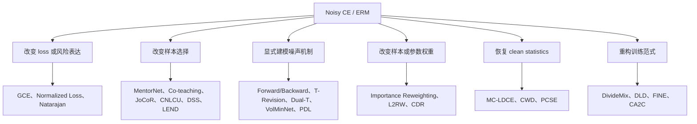
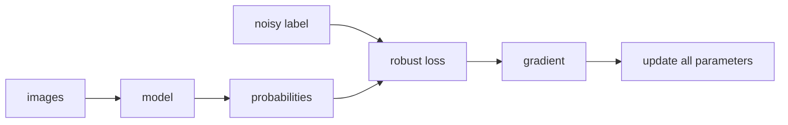
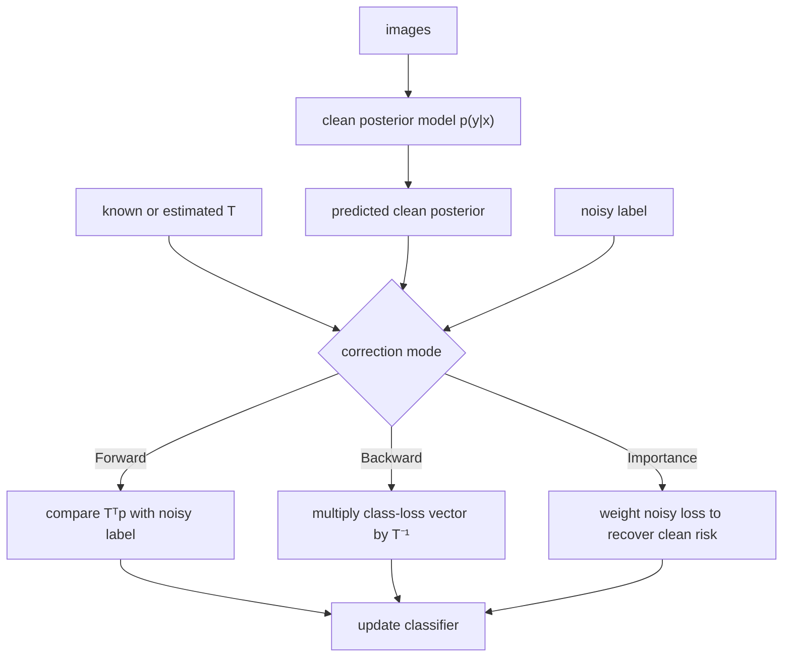
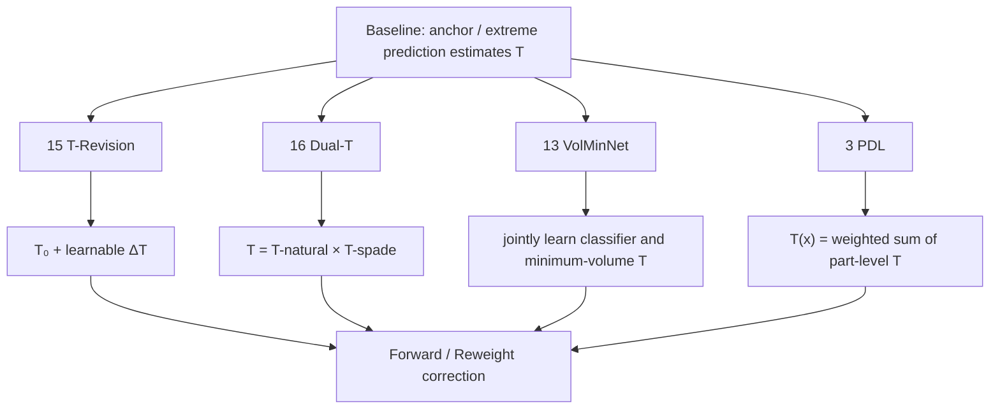
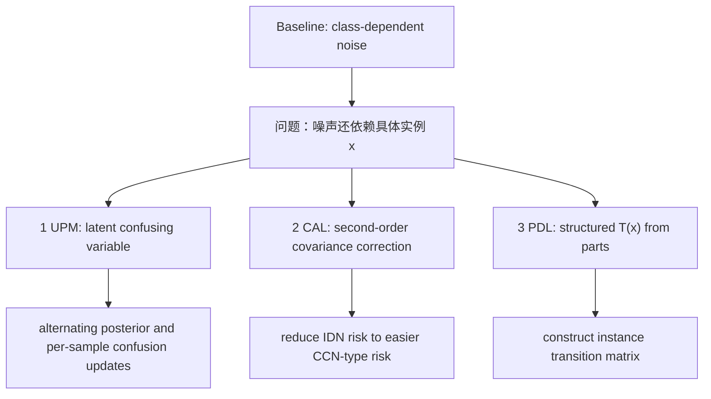
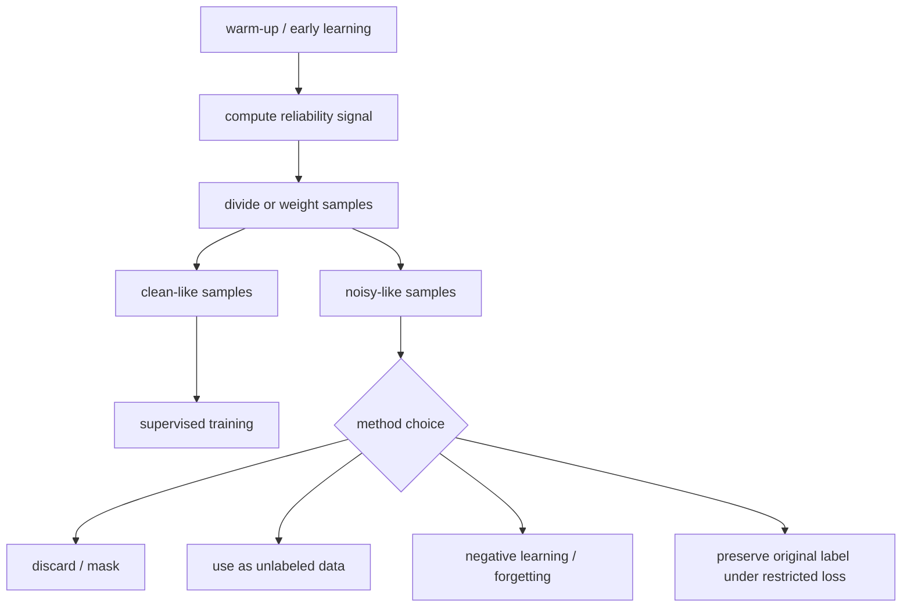
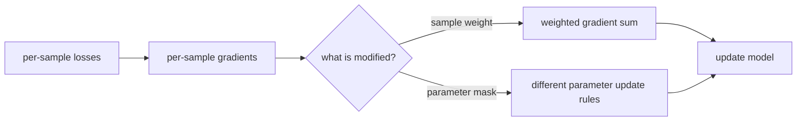
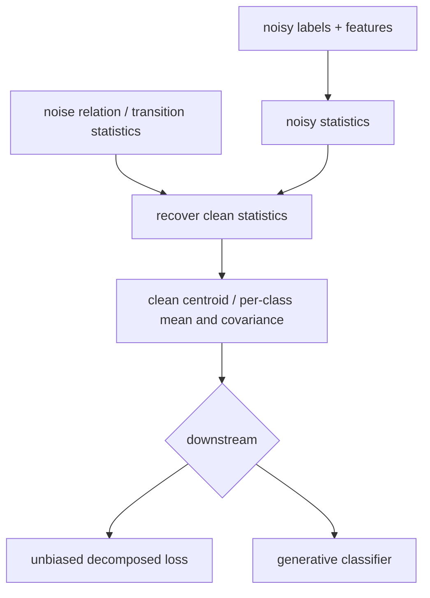
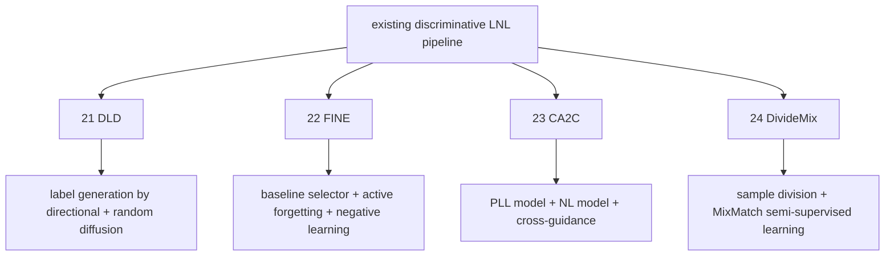

# LNL 论文的 baseline 谱系与算法关系

本文档不是按照论文使用的数学工具简单分组，而是回答两个问题：

1. 每一类方法删去创新后，剩下的最小 baseline 是什么？
2. 每篇论文究竟替换、扩展或组合了 baseline 的哪个部分？

这里的 `baseline` 指算法结构上的直接起点，不是论文实验表格中列出的所有比较方法。论文之间存在多重继承关系，因此整体结构是有向关系图，而不是严格的单父节点树。

## 0. 结合当前 summary 后的分类原则

当前 summary 已经形成了几项重要而且基本正确的认识：

- 应区分完整训练框架与可插拔模块。例如 DSS 中 `BASE` 是主体选择流程，MDA 和 CCS 是针对两类偏差的补充模块；FINE同样是附着在已有 selector 上的正则模块。
- 应区分样本选择、样本加权、标签修正、loss 修正、梯度修改和参数修改。它们表面上都在“减少噪声影响”，代码接口却完全不同。
- 转移矩阵论文通常共享同一个下游 baseline：先得到 `T`，再做 forward、backward 或 importance correction。论文的创新往往在 `T` 的识别方式，而不在分类器主体。
- 统计估计论文的核心不是“复杂公式本身”，而是寻找一个能从 noisy distribution 恢复 clean risk 的充分统计量，例如全局质心、逐类均值或协方差。
- warm-up 不是已经得到正确模型，而是为后续选择、纠错或统计估计提供一个不完全可靠的启动信号。

需要进一步修正的是：当前 `papers` 文件夹的分类适合文件管理，但不等于思想谱系。例如第6篇不是样本选择，第10篇的核心归属是转移矩阵校正，第20篇主要是统计后处理，第25篇是 meta reweighting，第26篇是 feature-based selector。

## 1. 总 baseline：Noisy CE / ERM

绝大多数论文最终都可以追溯到同一个最小训练流程：

```text
initialize model

for batch:
    logits = model(images)
    loss = CrossEntropy(logits, noisy_labels)
    update model using mean(loss)
```

它同时包含六个默认选择：

```text
监督信号：直接相信 noisy label
样本使用：所有样本等权参与
损失函数：Cross Entropy
模型结构：单网络判别式分类器
噪声机制：不显式建模
参数更新：所有参数接受同一目标的梯度
```

不同论文分别替换其中一个或多个默认选择：



---

# 2. 第一类：直接改变 loss 形状

## 2.1 这一类的 baseline

最小 baseline 是普通 CE：

```text
probabilities = softmax(logits)
loss = -log(probabilities[noisy_label])
```

这一类方法不一定估计哪些样本干净，也不一定估计转移矩阵，而是希望仅通过改变 `loss(probabilities, noisy_label)`，降低错误标签产生的过大梯度。

## 2.2 流程图



## 2.3 类树状关系

```text
普通分类 loss
├── CE
│   ├── 优点：高置信错误也会产生强梯度，学习快
│   └── 缺点：容易记忆 noisy label
│
├── MAE
│   ├── 优点：对称噪声下具有较强理论鲁棒性
│   └── 缺点：梯度容易饱和，深网训练慢、欠拟合
│
├── 第12篇 GCE
│   ├── baseline：CE + MAE
│   ├── 改动：用 q 在 CE 与 MAE 之间连续插值
│   └── 截断版：低置信样本不再继续贡献过强梯度
│
└── 第11篇 Normalized Loss / APL
    ├── baseline：任意已有 loss，包括 CE、GCE、RCE
    ├── 改动1：除以该预测对所有类别的 loss 总和
    ├── 目的1：让 loss 满足对称噪声下的常和条件
    ├── 问题：单纯归一化容易欠拟合
    └── 改动2：组合 active loss 与 passive loss
```

### 与 baseline 的本质关系

```text
GCE：在两个已有端点 CE 和 MAE 之间寻找折中
Normalized Loss：给任意 loss 套一层鲁棒化变换
APL：在归一化之后补回不足的学习能力
```

这一类最适合在 toolbox 中实现为纯 `Loss` 插件，不应要求修改 Runner 生命周期。

---

# 3. 第二类：已知噪声机制后的风险校正

## 3.1 这一类的 baseline

baseline 是类条件噪声模型：

\[
T_{ij}=P(\tilde Y=j\mid Y=i),
\qquad
P(\tilde Y\mid X)=T^\top P(Y\mid X).
\]

如果 `T` 已知，则可以把 noisy learning 转化为普通风险最小化。这里必须分开两个问题：

```text
问题A：已知 T 后，怎样使用 T？
问题B：现实中，怎样得到 T？
```

第14、10、18篇主要奠定问题A；第15、16、13篇主要修改问题B。

## 3.2 使用已知 T 的流程图



## 3.3 类树状关系

```text
已知类条件噪声率 / 转移矩阵
├── 第14篇 Learning with Noisy Labels
│   ├── baseline：二分类普通 surrogate risk
│   ├── 改动1：构造原 loss 的无偏 noisy estimator
│   ├── 改动2：把问题约化为加权 0-1 / surrogate risk
│   └── 局限：二分类；要求两个翻转率已知
│
├── 第10篇 Forward / Backward Correction
│   ├── baseline：第14篇的二分类无偏校正
│   ├── 推广：多分类转移矩阵 T + 深度网络
│   ├── Backward：校正 loss，理论无偏但 T⁻¹ 易放大误差
│   ├── Forward：校正预测，不求逆，数值更稳定
│   └── 额外模块：用高置信近似 anchor 估计 T
│
└── 第18篇 Importance Reweighting
    ├── baseline：普通 noisy empirical risk
    ├── 改动：将 clean risk 改写为 noisy risk 的加权形式
    ├── 权重来源：clean posterior / noisy posterior
    └── 风险：posterior 或噪声率误差会制造高方差权重
```

第18篇和第25篇虽然都叫 reweighting，但它们并非同一类：

```text
第18篇：概率统计推导出的理论权重；通常依赖噪声机制
第25篇：干净验证集通过 meta-gradient 在线学习权重
```

---

# 4. 第三类：转移矩阵 T 的估计与修订

## 4.1 这一类的 baseline

baseline 不是普通 CE，而是完整的两阶段 T-correction：

```text
train / obtain noisy posterior model
        ↓
estimate transition matrix T
        ↓
use T in Forward / Backward / Importance correction
        ↓
train final clean posterior classifier
```

这类论文通常不改变最后一步的 correction，而是替换中间的 `estimate T`。

## 4.2 总关系图



## 4.3 类树状关系

```text
Anchor / 极值预测估计 T
├── 第15篇 T-Revision
│   ├── 不完全否定 anchor：先用近似 anchor 得到 T₀
│   ├── 新增可训练 ΔT
│   ├── Tfinal = legalize(T₀ + ΔT)
│   └── 与标准CNN相比：ΔT和网络权重一样由loss反向传播更新
│
├── 第16篇 Dual-T
│   ├── 认为直接估计 T 的误差太大
│   ├── 引入中间标签 Y'
│   ├── 将 T 分解为两个更容易估计的矩阵
│   └── 矩阵估计结束后，下游 correction 不变
│
├── 第13篇 VolMinNet
│   ├── 认为真实 anchor 可能不存在
│   ├── 不再选择某几个极端样本决定 T
│   ├── 联合学习 clean posterior network 与 T
│   ├── 用最小 simplex 体积识别 T
│   └── 用 sufficiently-scattered 假设替代 anchor 假设
│
└── 第3篇 PDL
    ├── baseline 的 T 对所有同类实例相同
    ├── 改为每个实例拥有 T(x)
    ├── T(x) 由多个 part-level T 加权组合
    └── 仍需 anchor 和“部件组合权重可共享”等结构假设
```

这四篇不是严格的优劣递进，而是在修复四种不同问题：

```text
T-Revision：初始 T 有偏怎么办？
Dual-T：直接估计 T 方差太大怎么办？
VolMinNet：没有 anchor 怎么办？
PDL：同一类别不同实例的噪声机制不同怎么办？
```

---

# 5. 第四类：实例依赖噪声 IDN

## 5.1 这一类的 baseline

baseline 是 class-conditional noise：

\[
P(\tilde Y\mid Y,X)=P(\tilde Y\mid Y).
\]

也就是只要真实类别相同，所有实例共享同一个噪声机制。IDN论文指出现实中困难、模糊或特定结构的样本更容易被标错，因此需要：

\[
P(\tilde Y\mid Y,X).
\]

## 5.2 流程关系图



## 5.3 类树状关系

```text
从 CCN 扩展到 IDN
├── 第1篇 UPM：概率生成模型路线
│   ├── 区分 confusing / unconfusing instance
│   ├── 为每个样本维护混淆概率
│   ├── 估计潜在clean label posterior
│   └── posterior、逐样本变量与分类器交替优化
│
├── 第2篇 CAL：风险统计路线
│   ├── baseline：Peer Loss / CORES2 的一阶统计
│   ├── 指出IDN造成非均匀降权和类别/实例失衡
│   ├── 加入噪声率与Bayes标签的二阶协方差项
│   └── 将IDN问题转化为较容易处理的CCN型问题
│
└── 第3篇 PDL：结构化转移矩阵路线
    ├── 不直接自由估计任意 T(x)
    ├── 假设噪声由实例的语义部件引起
    └── 用part-level transition matrix组合近似 T(x)
```

三篇不是彼此扩展，而是对“不可识别的任意 IDN”加入三种不同结构：隐变量结构、二阶统计结构、部件组合结构。

---

# 6. 第五类：memorization 与样本选择

## 6.1 这一类的 baseline

最基本 baseline 是 small-loss/self-paced selection：

```text
warm up model

for batch:
    compute per-sample noisy-label loss
    select samples with smaller loss
    train only on selected samples
```

它依赖：

```text
DNN先学习容易且多数的干净模式
        ↓
训练早期 clean sample 通常 loss 更小
        ↓
small loss 可作为不完美的clean indicator
```

后续论文主要在修改四个位置：谁来打分、如何稳定打分、谁为谁选样本、被判为noisy的样本如何处理。

## 6.2 总流程图



## 6.3 类树状关系

```text
Small-loss / curriculum baseline
├── 第8篇 MentorNet
│   ├── baseline：人工预定义 curriculum / self-paced learning
│   ├── 改动：MentorNet根据loss、epoch、label等输出样本权重
│   └── StudentNet只负责执行加权训练
│
├── 第9篇 Co-teaching
│   ├── baseline1：单网络small-loss会自我确认
│   ├── baseline2：Decoupling只在双网分歧区域更新
│   ├── 改动：两个网络分别选小损失样本
│   └── 关键：A选出的样本更新B，B选出的样本更新A
│
├── 第4篇 JoCoR
│   ├── baseline：Co-teaching+强调双网disagreement
│   ├── 改动：联合CE + 双向KL形成joint loss
│   ├── 按joint small-loss选择同一组样本
│   └── 两个网络同时更新并逐渐达成agreement
│
├── 第7篇 CNLCU / Uncertainty Selection
│   ├── baseline：用当前时刻的单点loss排序
│   ├── 改动：维护固定时间区间的loss历史
│   ├── 用稳健均值和置信下界进行选择
│   └── 用被尝试次数给欠代表样本探索机会
│
├── 第5篇 DSS
│   ├── BASE：warm-up后选择预测类别与noisy label一致的样本
│   ├── MDA：动态校正类别边际，修复easy-class过选
│   ├── CCS：从CE分母暂时排除可能是真类的候选类
│   ├── CCS不重标注，只屏蔽错误负梯度
│   └── DSS = BASE + MDA + CCS
│
├── 第24篇 DivideMix
│   ├── baseline1：Co-teaching双网络交叉去偏
│   ├── baseline2：MixMatch半监督训练
│   ├── 用两分量GMM估计clean probability
│   ├── 每个网络使用另一个网络的数据划分
│   ├── clean-like样本做label refinement
│   └── noisy-like样本不丢弃，作为unlabeled做label guessing
│
└── 第26篇 LEND
    ├── baseline：依赖分类头预测或单点loss的早期选择
    ├── 改动：用embedding构造mini-batch kNN图
    ├── 从noisy one-hot出发做label noise dilution
    ├── 使用跨epoch momentum稳定稀释标签
    ├── 稀释标签只负责判断noisy label是否可信
    └── 被选样本最终仍使用原noisy label训练
```

## 6.4 直接关系树

```text
Self-paced / small-loss
├── MentorNet：把手工课程变成可学习课程网络
│   └── Co-teaching：把单网自选改成双网交叉选择
│       ├── JoCoR：不同意“必须保持分歧”，改为联合一致性
│       └── DivideMix：把被拒绝样本转化为半监督unlabeled数据
│
├── CNLCU：把单点loss改成带不确定性的时间统计
├── DSS：修复类别级与实例级确认偏差
└── LEND：把分类头信号改成特征邻域信号
```

---

# 7. 第六类：样本权重与参数更新方向

## 7.1 这一类的 baseline

普通SGD默认每个样本等权，并让所有参数接受同一个batch loss的梯度：

\[
g=\frac{1}{B}\sum_i \nabla_\theta \ell_i,
\qquad
\theta\leftarrow\theta-\eta g.
\]

这一类方法不一定删除样本，而是修改：

```text
样本i的梯度乘多少权重？
哪些参数允许接收该梯度？
```

## 7.2 流程图



## 7.3 类树状关系

```text
普通等权SGD
├── 第18篇 Importance Reweighting：概率统计权重
│   ├── 根据clean/noisy distribution ratio得到权重
│   └── 目标是让加权noisy risk等于clean risk
│
├── 第25篇 L2RW：meta-gradient样本权重
│   ├── 为当前batch建立从0开始的临时权重 epsilon
│   ├── 做一次虚拟训练参数更新
│   ├── 干净验证集判断虚拟更新方向是否有利
│   ├── 取负meta-gradient的非负部分并归一化
│   └── 用所得权重重新做正式训练更新
│
└── 第6篇 Robust Early-Learning / CDR：参数级权重
    ├── baseline：普通CE + early stopping
    ├── 用 |w_i × grad_i| 判断参数重要性
    ├── 关键参数：loss gradient + weight decay
    ├── 非关键参数：只做weight decay，不接收loss gradient
    └── 仍依赖noise rate决定关键参数比例，并使用验证集early stop
```

toolbox接口应分别是：

```text
Importance Reweighting / L2RW → SampleWeightProvider
CDR                           → ParameterUpdatePolicy
```

---

# 8. 第七类：Loss Decomposition 与统计恢复

## 8.1 这一类的 baseline

baseline 是把clean empirical risk拆成：

\[
R(W)=R_{\text{label-independent}}(W)
     +R_{\text{label-dependent}}(W,\mu).
\]

其中只有第二部分受标签噪声影响，而它可以由数据质心等统计量控制。因此问题从“逐个判断标签是否正确”转化为：

```text
从noisy data估计clean statistic
        ↓
把估计量代回clean risk
        ↓
最小化恢复后的风险
```

## 8.2 流程图



## 8.3 类树状关系

```text
Binary LDCE / 全局clean centroid估计
├── 第17篇 MC-LDCE
│   ├── baseline：二分类LDCE
│   ├── 将MSE分成label-independent与label-dependent部分
│   ├── 重新定义多分类矩阵质心 E[XYᵀ]
│   └── 恢复质心后构造多分类无偏风险
│
├── 第19篇 CWD
│   ├── baseline：一次性处理所有类别的全局质心估计
│   ├── 二分类中分别处理false positive与false negative
│   ├── 构造两个虚拟辅助集再组合clean centroid
│   ├── 目的：保持无偏的同时降低估计方差
│   └── 多分类扩展为逐类别虚拟集合
│
└── 第20篇 PCSE
    ├── baseline1：MC-LDCE/CWD只恢复全局质心
    ├── baseline2：RoG等方法通过实例选择估计逐类统计
    ├── 改动：使用全部noisy样本恢复每类prior、mean、covariance
    ├── 下游：使用GDA生成式分类器，而非继续训练原分类头
    └── 定位：可接在已有noisy预训练网络后面的post-processor
```

直接关系为：

```text
LDCE
├── MC-LDCE：binary → multi-class
├── CWD：global one-shot correction → class-wise lower-variance correction
└── PCSE：global centroid → per-class first/second-order statistics
```

PCSE同时吸收了MC-LDCE的多分类质心表示和CWD的逐类思想，但最终目标从“修正一个训练loss”进一步变成“构造逐类生成式分类器”。

---

# 9. 第八类：重构训练范式与可插拔混合模块

## 9.1 这一类的 baseline

baseline 是一个已有的判别式LNL训练器：

```text
image → backbone → logits → robust loss / selector → SGD
```

这些论文不只替换一个loss或selector，而是引入额外学习范式，或者作为插件改变noisy subset的处理方式。

## 9.2 流程图



## 9.3 类树状关系

```text
已有判别式LNL pipeline
├── 第21篇 DLD：改成生成式标签恢复
│   ├── baseline1：DDPM / conditional label diffusion / CARD
│   ├── baseline2：邻域一致性的label pre-correction
│   ├── random diffusion提供随机性
│   ├── directional diffusion显式朝估计噪声分布移动
│   └── 反向过程从随机标签逐步生成预测标签
│
├── 第22篇 FINE：给已有selector增加noisy-subset处理器
│   ├── baseline必须先提供clean/noisy划分
│   ├── early-stage：negative CE主动忘记已吸收的错误知识
│   ├── later-stage：complementary-label NL抑制继续拟合噪声
│   └── 不替换baseline的clean-sample supervised loss
│
├── 第23篇 CA2C：重新设计双网分工
│   ├── baseline1：Co-teaching等对称双网co-training
│   ├── baseline2：NPN在单模型混合PLL与NL
│   ├── P-model只做partial-label learning
│   ├── N-model只做negative learning
│   ├── 两网络交叉生成候选标签与互补标签
│   └── 使用置信重加权降低PLL消歧失败
│
└── 第24篇 DivideMix：sample selection + SSL组合
    ├── baseline1：Co-teaching双网交叉去偏
    ├── baseline2：MixMatch
    └── 最大变化：noisy-like样本不再被简单丢弃
```

第26篇LEND虽然也组合了图传播和样本选择，但主归属仍应是`Feature-based Selector`；第24篇DivideMix虽然属于本节的混合框架，其主干仍从small-loss双网谱系发展而来。

---

# 10. 26篇论文的主归属与交叉归属

| 编号 | 方法 | 主归属 | 交叉归属 | 直接baseline |
|---:|---|---|---|---|
| 1 | UPM | IDN概率模型 | label posterior refinement | 类条件/已有概率噪声模型 |
| 2 | CAL | IDN二阶统计 | robust loss | Peer Loss / CORES2一阶统计 |
| 3 | PDL | IDN转移矩阵 | T estimation | 类条件全局转移矩阵 |
| 4 | JoCoR | 双网样本选择 | consistency regularization | Co-teaching+ / Decoupling |
| 5 | DSS | 去偏样本选择 | loss denominator modification | BASE small-loss/预测一致选择 |
| 6 | CDR | 参数更新策略 | early stopping | CE + early stopping |
| 7 | CNLCU | 不确定性样本选择 | exploration curriculum | 单点small-loss selector |
| 8 | MentorNet | curriculum/weight provider | sample selection | 固定curriculum / self-paced learning |
| 9 | Co-teaching | 双网交叉样本选择 | co-training | MentorNet式small-loss + Decoupling |
| 10 | Forward/Backward | T-based risk correction | robust loss | 二分类无偏loss correction |
| 11 | Normalized Loss/APL | robust loss | loss composition | CE/GCE/RCE等已有loss |
| 12 | GCE | robust loss | truncated loss | CE + MAE |
| 13 | VolMinNet | T estimation | end-to-end joint learning | anchor-estimated T correction |
| 14 | Natarajan | unbiased risk correction | weighted surrogate | 二分类普通surrogate ERM |
| 15 | T-Revision | T revision | reweight / correction | 近似anchor初始化T |
| 16 | Dual-T | T decomposition | transition estimation | 直接估计T |
| 17 | MC-LDCE | 多分类质心风险 | unbiased risk | binary LDCE |
| 18 | Importance Reweighting | statistical sample weighting | noise-rate estimation | 普通noisy ERM |
| 19 | CWD | class-wise centroid | variance reduction | 全局centroid estimator |
| 20 | PCSE | statistic post-processing | generative classification | MC-LDCE/CWD + RoG |
| 21 | DLD | generative label recovery | neighborhood pre-correction | conditional label diffusion/CARD |
| 22 | FINE | regularizer plugin | machine unlearning / NL | 任意clean-sample reliant LNL baseline |
| 23 | CA2C | asymmetric dual-network learning | PLL + NL + reweighting | symmetric co-training + NPN |
| 24 | DivideMix | semi-supervised LNL | double-network selection | Co-teaching + MixMatch |
| 25 | L2RW | meta sample weighting | bilevel optimization | 手工loss-based weighting |
| 26 | LEND | feature-graph sample selection | label propagation | prediction/loss-based early selection |

---

# 11. 面向 LNL-toolbox 的最终组件树

如果目标是实现toolbox，最有用的分类不是论文所属文件夹，而是算法应接入哪个接口：

```text
LNLToolbox
├── Loss
│   ├── CrossEntropy
│   ├── GCE
│   ├── NormalizedLoss
│   ├── ActivePassiveLoss
│   ├── ForwardCorrectedLoss
│   └── BackwardCorrectedLoss
│
├── NoiseModel / TransitionEstimator
│   ├── KnownTransition
│   ├── AnchorTransition
│   ├── TRevision
│   ├── DualT
│   ├── VolMinTransition
│   └── PartDependentTransition
│
├── Selector / ReliabilityEstimator
│   ├── SmallLossSelector
│   ├── MentorNetSelector
│   ├── CoTeachingExchange
│   ├── JoCoRJointSelector
│   ├── UncertaintyIntervalSelector
│   ├── DSSSelector
│   └── LENDFeatureGraphSelector
│
├── WeightProvider
│   ├── ImportanceRatioWeight
│   └── L2RWMetaWeight
│
├── ParameterUpdatePolicy
│   └── CDRCriticalParameterUpdate
│
├── LabelProvider / LabelRefiner
│   ├── UPMPosterior
│   ├── DivideMixCoRefinement
│   ├── CA2CCrossGuidance
│   └── DLDLabelGenerator
│
├── Regularizer
│   ├── JoCoRAgreement
│   ├── FINEActiveForgetting
│   └── FINENoiseSuppression
│
├── StatisticEstimator
│   ├── MCLDCECentroid
│   ├── CWDClassWiseCentroid
│   └── PCSEPerClassStatistics
│
└── Pipeline
    ├── StandardNoisyERM
    ├── CoTeachingPipeline
    ├── DivideMixPipeline
    ├── CA2CPipeline
    └── DLDGenerativePipeline
```

## 11.1 关键架构结论

1. `Loss`、`Selector`、`WeightProvider`、`LabelProvider`不能共用一个模糊的“denoiser”接口。
2. `TransitionEstimator`的输出应是独立artifact；Forward、Backward和Importance correction只消费它，不负责估计它。
3. `Selector`必须明确输出hard mask、soft weight还是clean probability。
4. `LabelProvider`必须明确输出soft target、hard pseudo-label、candidate set还是complementary set。
5. CDR修改optimizer step，不能伪装成普通loss插件。
6. PCSE主要消费已训练模型的embedding，应作为post-processing pipeline。
7. DivideMix、CA2C和DLD改变Runner生命周期，应实现为独立pipeline，而不是把所有逻辑塞进通用Runner。
8. DSS、FINE等插件应保留可组合性，能够挂载到不止一个baseline。

## 11.2 最简理解

```text
有些论文问：应该算什么loss？
    → GCE、Normalized Loss、Forward/Backward

有些论文问：哪些样本应该参与？
    → MentorNet、Co-teaching、JoCoR、CNLCU、DSS、LEND

有些论文问：每个样本应该有多大作用？
    → Importance Reweighting、L2RW

有些论文问：噪声是怎么产生的？
    → UPM、CAL、PDL、T-family

有些论文问：哪些参数应该接受梯度？
    → CDR

有些论文问：能否恢复clean distribution的统计量？
    → MC-LDCE、CWD、PCSE

有些论文问：是否应重构整个训练范式？
    → DivideMix、DLD、FINE、CA2C
```

这也是当前26篇论文最稳定、最适合toolbox实现的分类方式。
