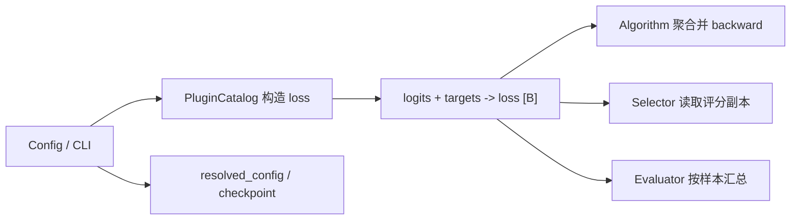

# Loss 板块第一轮总结

## 这一轮实现了什么

我们把 loss 从“训练代码里写死 CE”改成了“按配置选择并构造”。目前可直接训练的 PyTorch loss 有：CE、GCE、NCE、MAE、RCE 和 APL。

所有 loss 统一使用同一个接口：

```python
values = loss(logits, targets)
```

- `logits`：形状 `[batch, classes]`。
- `targets`：形状 `[batch]`，类型必须是 `torch.long`。
- `values`：必须返回 `[batch]`，即每个样本一个 loss。训练代码最后再调用 `.mean()`，方便以后做 Co-teaching 选样或样本加权。

## 文件和接口

### `src/lnl_toolbox/losses/torch_losses.py`

- `_validate_inputs(logits, targets)`：检查输入形状和标签类型。
- `validate_per_sample_loss(values, batch_size)`：检查 loss 是否遵守 `[batch]` 输出约定。
- `_target_log_probability(logits, targets)`：稳定地取得每个样本正确类别的对数概率。
- `CrossEntropyLoss.forward(logits, targets)`：逐样本 CE。
- `GeneralizedCrossEntropyLoss(q=0.7)`：标准 GCE；`q→0` 时接近 CE，`q=1` 时接近 MAE 风格，不含隐式截断阈值。
- `NormalizedCrossEntropyLoss(eps=1e-8)`：NCE，把 CE 按所有候选类别的 CE 总和归一化。
- `MeanAbsoluteErrorLoss(scale=2.0)`：分类 MAE。
- `ReverseCrossEntropyLoss(log_zero=-4.0)`：数值稳定的 RCE。
- `ActivePassiveLoss(active, passive, alpha=1.0, beta=1.0)`：计算 `alpha × active + beta × passive`。第一轮只支持 NCE 作为 active，MAE 或 RCE 作为 passive。

### 注册、配置和调用

- `src/lnl_toolbox/losses/__init__.py`：统一导出上述 PyTorch loss；未安装 PyTorch 时仍保留 NumPy 参考实现。
- `src/lnl_toolbox/plugins/builtin/catalog.py`
  - `create_builtin_catalog()`：把 PyTorch loss 注册为 `kind="loss"`，把 NumPy 参考实现单独注册为 `kind="numpy_loss"`。
  - `build_builtin_loss(config, catalog=None)`：读取 YAML 风格配置并创建 loss；APL 会递归创建 active/passive 子 loss。
- `src/lnl_toolbox/algorithms/supervised.py`
  - `SupervisedClassificationAlgorithm.step(batch, state)`：验证逐样本 loss，取均值后反向传播。
- `src/lnl_toolbox/training/clean_baseline.py`
  - `run_clean_experiment(...)`：通过 `build_builtin_loss(config["loss"])` 使用所选 loss。
- `src/lnl_toolbox/training/experiment.py`
  - `run_experiment(...)`：通用训练入口也使用同一构造接口。
- `src/lnl_toolbox/evaluation/classification.py`
  - `evaluate_classification(model, loader, loss, device)`：按逐样本 loss 求整个数据集的真实平均值。
- `src/lnl_toolbox/cli/__init__.py`
  - `_prompt_loss(session, current)`：在交互式 CLI 中选择 loss，并填写 `q`、`eps`、`scale`、`log_zero`、`alpha`、`beta` 等参数。

调用关系：

```text
YAML / 交互式 CLI
        ↓ loss 配置
build_builtin_loss()
        ↓ nn.Module
训练 step / evaluate_classification()
        ↓
validate_per_sample_loss() → 求均值或汇总指标
```

## 配置和测试

- `configs/algorithm/ce.yaml`、`gce.yaml`：统一为直接可构造的 loss 配置。
- 新增 `configs/algorithm/nce.yaml`、`apl.yaml`；实验配置增加 `loss: {name: ce}`。
- `tests/test_losses.py`：验证公式、边界参数、极端 logits 的有限 loss/梯度和 APL 组合结果。
- `tests/test_plugins.py`：验证注册表、配置构造、APL 递归构造和错误配置。
- `tests/test_torch_training.py`：验证六种 loss 都能完成一次训练并更新参数，同时拒绝返回标量的旧式 loss。

第一轮的核心结果是：后续新增 loss 时，只需实现返回 `[batch]` 的 `nn.Module`、注册到 catalog，并补配置与测试，不需要再改训练主循环。

## 第二轮收口

- 标准 GCE 严格使用论文公式 `(1 - p_y^q) / q`，不再通过 `eps` 隐式截断低概率样本；Truncated GCE 未在本轮实现。
- APL 的 `alpha`、`beta` 必须严格为正；P0 active 仅允许 NCE，passive 仅允许 MAE 或 RCE。
- APL 约束同时作用于直接构造、PluginCatalog 和 YAML builder，避免绕过后仍被错误标记为 `noise_robust`。
- CLI、数学测试和组件测试均覆盖上述约束；训练接口仍保持逐样本 `[batch]` 输出。

## 跨板块调用协议（收口版）

### 统一构造入口

其他板块不根据名称直接导入具体 loss 类，而是传递 YAML-compatible mapping：

```yaml
loss:
  name: gce
  q: 0.7
```

调用方通过 `build_builtin_loss(config, catalog=None)` 得到 `nn.Module`。内置 loss 使用默认 catalog；扩展组件可传入注册了自定义 `kind="loss"` 的 catalog。实验入口缺少 `loss` 时兼容为 CE，最终采用的 mapping 必须写入 `resolved_config.yaml`。

### 张量合同

| 项目 | 统一要求 |
|---|---|
| `logits` | 浮点 Tensor，形状 `[B, C]`，必须是模型原始 logits，不预先 softmax |
| `targets` | `torch.long` Tensor，形状 `[B]`，类别值位于 `[0, C)` |
| 设备 | logits、targets 和 loss module 位于同一设备 |
| 返回值 | 浮点 Tensor，严格形状 `[B]`，每个样本一个 loss |
| 梯度 | 返回值保留 autograd graph；loss 内部不得 `mean/sum/detach/item/numpy` |
| 稳定性 | 有限输入下 loss 和反向梯度应有限；通过单元测试验收 |

`validate_per_sample_loss(values, batch_size)` 在训练与评估边界统一检查返回类型和 `[B]` shape。当前协议只支持单标签硬标签分类，不支持 soft label、mixup、label smoothing 或 multi-label target。

### 各消费板块的职责



| 调用方 | 可以做什么 | 不应该做什么 |
|---|---|---|
| Algorithm | 对 `[B]` 做 mean、mask 或加权，再 backward | 要求 loss 自己聚合或管理 optimizer |
| Selector / Reliability | 使用 `per_sample_loss.detach()` 的副本排序或估计可靠性 | detach 用于 backward 的原始 loss，或把选样逻辑写进基础 loss |
| WeightProvider | 返回 `[B]` 权重，由 Algorithm 与 loss 相乘后聚合 | 修改 loss 公式或读取 clean label |
| Evaluator | 在 `inference_mode` 下求和并除以样本总数 | 假定 loss 已返回标量 |
| CLI / Config | 生成和保存 loss mapping | 包含训练数学 |
| Checkpoint | 依靠 resolved config 复现无状态 loss 参数 | 为当前无状态 loss 增加私有 checkpoint 字段 |

标准监督训练的调用形式为：

```python
per_sample = validate_per_sample_loss(loss(logits, targets), int(targets.numel()))
objective = per_sample.mean()
objective.backward()
```

如果后续 selector 需要评分，应保留 `per_sample` 用于反向传播，只对 `per_sample.detach()` 的副本做排序。当前 APL 仍执行 P0 限制：active 只能是 NCE，passive 只能是 MAE 或 RCE，且两个权重严格为正。

### 自定义 loss 的最低接入要求

1. 实现遵守上述 `[B]` 合同的 `nn.Module`。
2. 注册为 `kind="loss"`，至少声明 `per_sample` 和 `torch` capability。
3. 为公式、极端 logits、反向梯度、非法输入和一个训练 step 增加测试。
4. 增加配置参数说明，但不要修改通用训练循环。

依赖转移矩阵、样本历史、双网络或阶段状态的方法不应伪装成普通 loss；它们应由 `RiskCorrector`、Selector 或具体 Algorithm/Pipeline 持有状态，再消费本协议输出的逐样本 loss。
